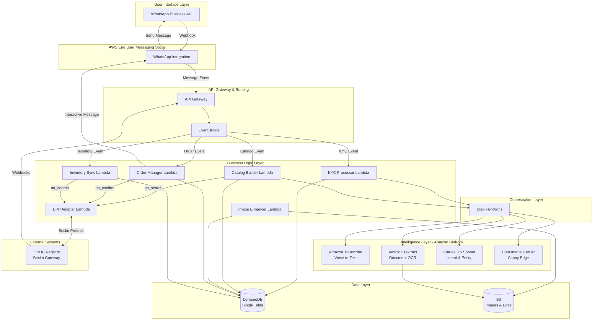
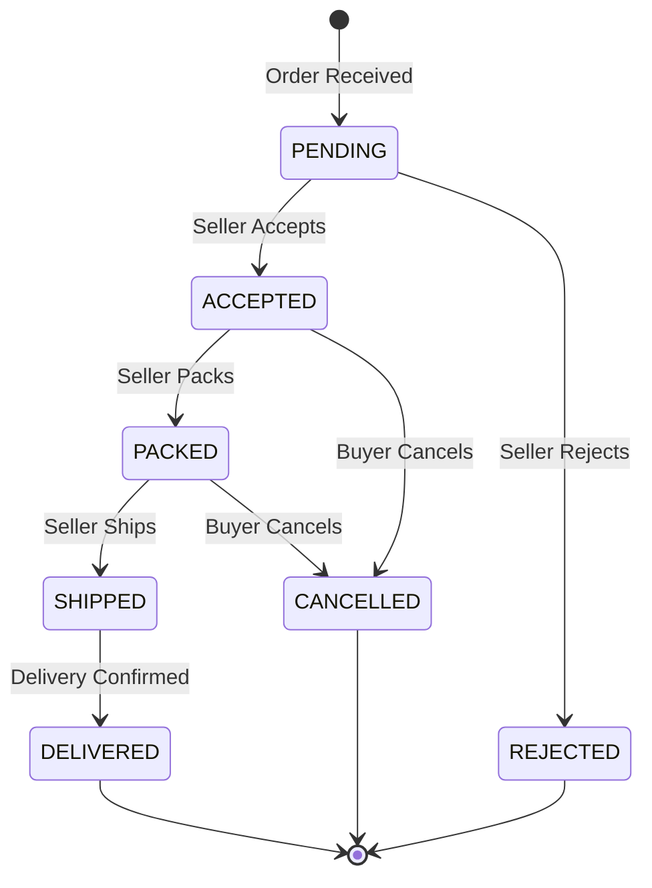

# Design Document: Vyapar-Vaani

## Overview

Vyapar-Vaani is a headless ONDC Seller Node that democratizes digital commerce for rural Indian merchants through a voice-first, zero-UI architecture. The system eliminates traditional barriers to e-commerce participation by enabling complete lifecycle management—from KYC onboarding to order fulfillment—exclusively through WhatsApp voice notes and images.

### Design Philosophy

The design prioritizes three core principles:

1. **Frugality**: Scale-to-zero serverless architecture ensures costs align with actual usage, making the solution economically viable for rural commerce where transaction volumes may be unpredictable.

2. **Accessibility**: Every interaction is designed for users with zero digital literacy, supporting vernacular languages and eliminating the need for typing, form-filling, or navigating complex interfaces.

3. **Compliance**: Strict adherence to ONDC/Beckn Protocol v1.2.0 ensures seamless interoperability with the broader ONDC ecosystem while maintaining data security and privacy standards.

### Architecture Style

The system employs an **event-driven serverless architecture** built entirely on AWS native services. This choice is driven by:

- **Cost Efficiency**: Lambda's pay-per-invocation model and DynamoDB's on-demand billing eliminate idle costs
- **Automatic Scaling**: Services scale from zero to handle variable rural commerce patterns without manual intervention
- **Managed Operations**: AWS-managed services reduce operational overhead, critical for a hackathon-to-production timeline
- **AI Integration**: Native integration with Amazon Bedrock, Transcribe, and Textract simplifies the AI pipeline

## Architecture

### High-Level Architecture Diagram



### Component Selection Rationale

**Why AWS End User Messaging (Social) over direct WhatsApp Business API?**
- Managed webhook handling and message routing
- Built-in retry logic and delivery guarantees
- Simplified authentication and token management
- Native integration with EventBridge for event-driven workflows

**Why Step Functions over Lambda chaining?**
- AI operations (image generation, OCR) can take 10-30 seconds, exceeding Lambda's practical timeout for synchronous chains
- Visual workflow monitoring for debugging complex AI pipelines
- Built-in error handling, retries, and state persistence
- Prevents "timeout cascade" failures in long-running processes

**Why DynamoDB Single Table Design over RDS?**
- Sub-millisecond latency for high-frequency catalog lookups
- On-demand billing scales to zero during idle periods
- No connection pooling overhead (critical for Lambda)
- Native support for complex access patterns through GSIs

**Why EventBridge over SNS/SQS?**
- Content-based routing enables clean separation of concerns
- Schema registry for event validation
- Archive and replay capabilities for debugging
- Native integration with 20+ AWS services

## Components and Interfaces

### 1. WhatsApp Integration Layer

**Component**: AWS End User Messaging (Social) + API Gateway

**Responsibilities**:
- Receive incoming WhatsApp messages (text, voice, images)
- Send outgoing messages (text, interactive buttons, images)
- Handle webhook verification and authentication
- Route messages to EventBridge

**Interface**:

```typescript
// Incoming Message Event
interface WhatsAppInboundEvent {
  messageId: string;
  from: string; // Phone number in E.164 format
  timestamp: number;
  type: 'text' | 'audio' | 'image' | 'button_reply';
  content: {
    text?: string;
    mediaUrl?: string; // S3 pre-signed URL for audio/image
    mimeType?: string;
    buttonPayload?: string; // For interactive button responses
  };
  profile: {
    name: string;
    language?: string; // Detected or stored preference
  };
}

// Outgoing Message Request
interface WhatsAppOutboundMessage {
  to: string; // Phone number
  type: 'text' | 'interactive' | 'image';
  content: {
    text?: string;
    imageUrl?: string;
    buttons?: Array<{
      id: string;
      title: string;
    }>;
  };
  language: 'hi' | 'mr' | 'en';
}
```

### 2. Event Router

**Component**: Amazon EventBridge

**Responsibilities**:
- Route incoming messages to appropriate Lambda functions based on content type
- Trigger Step Functions workflows for long-running AI operations
- Handle ONDC webhook events from external BAPs
- Implement event replay for debugging

**Event Patterns**:

```json
{
  "source": "vyapar.vaani.whatsapp",
  "detail-type": [
    "message.received.voice",
    "message.received.image",
    "message.received.text",
    "button.clicked"
  ]
}

{
  "source": "vyapar.vaani.ondc",
  "detail-type": [
    "order.confirm.received",
    "order.status.requested",
    "order.cancel.received"
  ]
}
```

### 3. KYC Processor

**Component**: Lambda Function + Step Functions Workflow

**Responsibilities**:
- Orchestrate document processing workflow
- Extract text from PAN/Aadhar images using Amazon Textract
- Validate extracted fields against ONDC requirements
- Register seller as Sub-Network Participant
- Store encrypted KYC data in DynamoDB

**Step Functions Workflow**:

```yaml
States:
  DownloadDocument:
    Type: Task
    Resource: arn:aws:lambda:DOWNLOAD_FROM_S3
    Next: ExtractText
    
  ExtractText:
    Type: Task
    Resource: arn:aws:states:aws-sdk:textract:analyzeDocument
    Parameters:
      DocumentLocation:
        S3Object:
          Bucket.$: $.bucket
          Name.$: $.key
      FeatureTypes:
        - FORMS
        - TABLES
    Next: ParseKYCFields
    
  ParseKYCFields:
    Type: Task
    Resource: arn:aws:lambda:PARSE_KYC_LAMBDA
    Next: ValidateFields
    
  ValidateFields:
    Type: Choice
    Choices:
      - Variable: $.valid
        BooleanEquals: true
        Next: RegisterSeller
      - Variable: $.valid
        BooleanEquals: false
        Next: RequestClarification
        
  RegisterSeller:
    Type: Task
    Resource: arn:aws:lambda:REGISTER_ONDC_LAMBDA
    Next: SendConfirmation
    
  SendConfirmation:
    Type: Task
    Resource: arn:aws:lambda:SEND_WHATSAPP_LAMBDA
    End: true
    
  RequestClarification:
    Type: Task
    Resource: arn:aws:lambda:SEND_WHATSAPP_LAMBDA
    End: true
```

**Data Model**:

```typescript
interface SellerProfile {
  PK: string; // SELLER#<phone_number>
  SK: string; // PROFILE
  sellerId: string; // UUID
  phone: string;
  name: string;
  language: 'hi' | 'mr' | 'en';
  kyc: {
    panNumber: string;
    aadharNumber: string; // Encrypted
    documentUrls: string[]; // S3 URLs
    verifiedAt: number;
    status: 'PENDING' | 'VERIFIED' | 'REJECTED';
  };
  ondc: {
    subscriberId: string;
    subscriberUrl: string;
    signingPublicKey: string;
    encryptionPublicKey: string;
  };
  createdAt: number;
  updatedAt: number;
}
```

### 4. Voice-to-Protocol Translator

**Component**: Lambda Function + Amazon Transcribe + Claude 3.5 Sonnet

**Responsibilities**:
- Transcribe voice notes to text (Hindi/Marathi/English)
- Classify intent using Claude 3.5 Sonnet
- Extract structured entities from unstructured voice input
- Map entities to Beckn Protocol JSON schemas
- Validate constructed JSON against ONDC specifications

**Intent Classification Prompt**:

```
You are an intent classifier for an ONDC seller management system. 
The user is a rural merchant speaking in Hindi, Marathi, or English.

Classify the following transcribed voice note into ONE of these intents:
- CREATE_CATALOG: User wants to add a new product
- UPDATE_INVENTORY: User wants to change stock quantity
- ACCEPT_ORDER: User wants to accept an order
- REJECT_ORDER: User wants to reject an order
- UPDATE_FULFILLMENT: User wants to update order status (packed, shipped, delivered)
- QUERY_STATUS: User wants to check order or catalog status

Transcription: {transcribed_text}

Respond with JSON:
{
  "intent": "<INTENT_NAME>",
  "confidence": <0.0-1.0>,
  "language": "hi|mr|en"
}
```

**Entity Extraction Prompt**:

```
Extract structured product information from this voice note.

Transcription: {transcribed_text}
Intent: CREATE_CATALOG

Extract these fields:
- product_name: string
- price: number (in INR)
- quantity: number
- unit: string (kg, liters, pieces, packets)
- description: string (optional)
- category: string (food, grocery, handicraft, textile)

Respond with JSON conforming to this schema:
{
  "product_name": "...",
  "price": 200,
  "quantity": 5,
  "unit": "kg",
  "description": "...",
  "category": "food"
}

If any required field is missing, set it to null.
```

**Interface**:

```typescript
interface VoiceProcessingResult {
  transcription: string;
  language: 'hi' | 'mr' | 'en';
  intent: {
    type: 'CREATE_CATALOG' | 'UPDATE_INVENTORY' | 'ACCEPT_ORDER' | 'REJECT_ORDER' | 'UPDATE_FULFILLMENT' | 'QUERY_STATUS';
    confidence: number;
  };
  entities: Record<string, any>;
  becknPayload?: object; // Constructed Beckn Protocol JSON
  validationErrors?: string[];
}
```

### 5. Catalog Builder

**Component**: Lambda Function + Step Functions Workflow

**Responsibilities**:
- Construct Beckn Catalog Objects from extracted entities
- Validate against ONDC v1.2.0 schema
- Trigger image enhancement workflow
- Store catalog in DynamoDB
- Broadcast catalog via BPP Adapter

**Beckn Catalog Object Schema**:

```typescript
interface BecknCatalogItem {
  id: string; // UUID
  descriptor: {
    name: string; // Product name in vernacular
    code: string; // Optional: HSN/SAC code
    symbol: string; // Image URL
    short_desc: string;
    long_desc: string;
    images: string[]; // Enhanced image URLs
  };
  price: {
    currency: 'INR';
    value: string; // Decimal string
    maximum_value?: string;
  };
  quantity: {
    available: {
      count: number;
    };
    maximum: {
      count: number;
    };
  };
  category_id: string; // ONDC category taxonomy
  fulfillment_id: string;
  location_id: string;
  time: {
    label: 'enable' | 'disable';
    timestamp: string; // ISO 8601
  };
  tags: Array<{
    code: string;
    list: Array<{
      code: string;
      value: string;
    }>;
  }>;
}
```

**ONDC on_search Payload Structure**:

```json
{
  "context": {
    "domain": "nic2004:52110",
    "country": "IND",
    "city": "*",
    "action": "on_search",
    "core_version": "1.2.0",
    "bap_id": "<buyer_app_id>",
    "bap_uri": "<buyer_app_uri>",
    "bpp_id": "vyapar-vaani.ondc.in",
    "bpp_uri": "https://api.vyapar-vaani.ondc.in",
    "transaction_id": "<uuid>",
    "message_id": "<uuid>",
    "timestamp": "2024-01-15T10:30:00.000Z"
  },
  "message": {
    "catalog": {
      "bpp/descriptor": {
        "name": "Vyapar Vaani",
        "symbol": "https://vyapar-vaani.in/logo.png",
        "short_desc": "Rural Merchant Network",
        "long_desc": "Empowering rural merchants through voice-first commerce",
        "images": ["https://vyapar-vaani.in/banner.png"]
      },
      "bpp/providers": [
        {
          "id": "<seller_id>",
          "descriptor": {
            "name": "<seller_name>",
            "symbol": "<seller_logo_url>",
            "short_desc": "<seller_description>",
            "long_desc": "<seller_long_description>",
            "images": ["<seller_image_url>"]
          },
          "locations": [
            {
              "id": "<location_id>",
              "gps": "28.6139,77.2090",
              "address": {
                "locality": "<locality>",
                "street": "<street>",
                "city": "<city>",
                "state": "<state>",
                "country": "IND",
                "area_code": "<pincode>"
              }
            }
          ],
          "items": [
            {
              "id": "<item_id>",
              "descriptor": {
                "name": "Mango Pickle",
                "code": "10039990",
                "symbol": "https://s3.amazonaws.com/vyapar-vaani/products/enhanced_<uuid>.jpg",
                "short_desc": "Homemade mango pickle",
                "long_desc": "Traditional Maharashtrian mango pickle made with organic ingredients",
                "images": ["https://s3.amazonaws.com/vyapar-vaani/products/enhanced_<uuid>.jpg"]
              },
              "price": {
                "currency": "INR",
                "value": "200.00",
                "maximum_value": "200.00"
              },
              "quantity": {
                "available": {
                  "count": 50
                },
                "maximum": {
                  "count": 10
                }
              },
              "category_id": "Grocery",
              "fulfillment_id": "F1",
              "location_id": "<location_id>",
              "@ondc/org/returnable": false,
              "@ondc/org/cancellable": true,
              "@ondc/org/return_window": "P0D",
              "@ondc/org/seller_pickup_return": false,
              "@ondc/org/time_to_ship": "P2D",
              "@ondc/org/available_on_cod": true,
              "@ondc/org/contact_details_consumer_care": "<phone>,<email>"
            }
          ]
        }
      ]
    }
  }
}
```

**Data Model**:

```typescript
interface CatalogItem {
  PK: string; // SELLER#<seller_id>
  SK: string; // ITEM#<item_id>
  itemId: string;
  sellerId: string;
  becknItem: BecknCatalogItem;
  images: {
    raw: string; // S3 URL
    enhanced: string; // S3 URL
  };
  status: 'DRAFT' | 'ACTIVE' | 'OUT_OF_STOCK' | 'ARCHIVED';
  createdAt: number;
  updatedAt: number;
  version: number; // For optimistic locking
}
```

### 6. Image Enhancement Engine

**Component**: Lambda Function + Amazon Titan Image Generator v2

**Responsibilities**:
- Process raw product photos using Canny Edge conditioning
- Generate professional backgrounds while preserving product structure
- Validate output for truthfulness (no hallucinated details)
- Store both raw and enhanced images in S3
- Update catalog with enhanced image URLs

**Titan Image Generator Configuration**:

```typescript
interface TitanImageRequest {
  taskType: 'IMAGE_VARIATION';
  imageVariationParams: {
    images: string[]; // Base64 encoded raw image
    text: string; // Prompt for background generation
    negativeText: string; // What to avoid
    similarityStrength: number; // 0.7-0.9 for high preservation
  };
  imageGenerationConfig: {
    numberOfImages: 1;
    quality: 'premium';
    height: 1024;
    width: 1024;
    cfgScale: 8.0; // Guidance scale
    seed: number; // For reproducibility
  };
  conditioningMode: 'CANNY_EDGE'; // Critical for structure preservation
}
```

**Prompt Engineering**:

```
Positive Prompt:
"Professional product photography, {product_name} on a clean kitchen counter, 
natural lighting, studio quality, commercial photography, high resolution, 
sharp focus, neutral background, food photography style"

Negative Prompt:
"text, watermark, logo changes, label modifications, color alterations, 
shape distortion, unrealistic elements, extra objects, blurry, low quality"
```

**Validation Logic**:

```typescript
async function validateEnhancedImage(
  rawImageUrl: string,
  enhancedImageUrl: string
): Promise<boolean> {
  // Use Amazon Rekognition to compare images
  const rawLabels = await rekognition.detectLabels({ Image: { S3Object: { Bucket, Key: rawImageUrl } } });
  const enhancedLabels = await rekognition.detectLabels({ Image: { S3Object: { Bucket, Key: enhancedImageUrl } } });
  
  // Ensure primary object labels match
  const rawPrimaryLabels = rawLabels.Labels.slice(0, 5).map(l => l.Name);
  const enhancedPrimaryLabels = enhancedLabels.Labels.slice(0, 5).map(l => l.Name);
  
  const overlap = rawPrimaryLabels.filter(label => enhancedPrimaryLabels.includes(label));
  
  // Require at least 60% label overlap
  return overlap.length / rawPrimaryLabels.length >= 0.6;
}
```

### 7. Order Management System

**Component**: Lambda Function + Interactive WhatsApp Messages

**Responsibilities**:
- Receive ONDC order webhooks (confirm, status, cancel)
- Parse order details and format for seller
- Send interactive WhatsApp messages with action buttons
- Process seller responses and send Beckn callbacks
- Track order state transitions

**Order State Machine**:



**Interactive Message Format**:

```typescript
interface OrderNotification {
  type: 'interactive';
  content: {
    text: `🛒 नया ऑर्डर!\n\nग्राहक: ${buyerName}\nउत्पाद: ${itemName}\nमात्रा: ${quantity}\nकीमत: ₹${totalPrice}\n\nपता: ${deliveryAddress}`,
    buttons: [
      {
        id: 'ACCEPT_ORDER',
        title: '✅ स्वीकार करें'
      },
      {
        id: 'REJECT_ORDER',
        title: '❌ अस्वीकार करें'
      }
    ]
  };
  language: 'hi';
}
```

**Data Model**:

```typescript
interface Order {
  PK: string; // ORDER#<order_id>
  SK: string; // METADATA
  orderId: string;
  sellerId: string;
  buyerAppId: string;
  transactionId: string;
  items: Array<{
    itemId: string;
    quantity: number;
    price: number;
  }>;
  fulfillment: {
    type: 'Delivery' | 'Pickup';
    address?: {
      name: string;
      building: string;
      locality: string;
      city: string;
      state: string;
      country: string;
      area_code: string;
    };
    contact: {
      phone: string;
      email?: string;
    };
  };
  payment: {
    type: 'ON-ORDER' | 'ON-FULFILLMENT' | 'POST-FULFILLMENT';
    status: 'PAID' | 'NOT-PAID';
    amount: number;
  };
  status: 'PENDING' | 'ACCEPTED' | 'REJECTED' | 'PACKED' | 'SHIPPED' | 'DELIVERED' | 'CANCELLED';
  timeline: Array<{
    status: string;
    timestamp: number;
  }>;
  createdAt: number;
  updatedAt: number;
}
```

### 8. BPP Adapter

**Component**: Lambda Function

**Responsibilities**:
- Implement all Beckn Protocol BPP APIs
- Sign outgoing messages with BPP private key
- Verify incoming messages with BAP public key
- Transform internal data models to Beckn Protocol format
- Handle ONDC-specific extensions and tags

**API Endpoints**:

```typescript
// Implemented Beckn APIs
const becknApis = {
  // Catalog Discovery
  search: async (context, message) => { /* Return on_search */ },
  
  // Order Placement
  select: async (context, message) => { /* Return on_select */ },
  init: async (context, message) => { /* Return on_init */ },
  confirm: async (context, message) => { /* Return on_confirm */ },
  
  // Order Tracking
  status: async (context, message) => { /* Return on_status */ },
  track: async (context, message) => { /* Return on_track */ },
  
  // Order Modification
  update: async (context, message) => { /* Return on_update */ },
  cancel: async (context, message) => { /* Return on_cancel */ },
  
  // Post-Fulfillment
  rating: async (context, message) => { /* Return on_rating */ },
  support: async (context, message) => { /* Return on_support */ }
};
```

**Digital Signature Implementation**:

```typescript
async function signBecknMessage(payload: object, privateKey: string): Promise<string> {
  const signingString = createSigningString(payload);
  const signature = crypto
    .createSign('sha256')
    .update(signingString)
    .sign(privateKey, 'base64');
  
  return `Signature keyId="${subscriberId}|${uniqueKeyId}|ed25519",algorithm="ed25519",created="${timestamp}",expires="${expires}",headers="(created) (expires) digest",signature="${signature}"`;
}

function createSigningString(payload: object): string {
  const digest = crypto
    .createHash('sha256')
    .update(JSON.stringify(payload))
    .digest('base64');
  
  return `(created): ${timestamp}\n(expires): ${expires}\ndigest: BLAKE-512=${digest}`;
}
```

### 9. Inventory Synchronization

**Component**: Lambda Function

**Responsibilities**:
- Process voice-based inventory updates
- Update catalog quantities in DynamoDB
- Broadcast updated catalog via on_search
- Handle out-of-stock scenarios
- Support bulk inventory updates

**Interface**:

```typescript
interface InventoryUpdate {
  sellerId: string;
  updates: Array<{
    itemId: string;
    itemName?: string; // For fuzzy matching
    quantity: number;
    operation: 'SET' | 'INCREMENT' | 'DECREMENT';
  }>;
  source: 'VOICE' | 'ORDER_FULFILLMENT' | 'MANUAL';
  timestamp: number;
}
```

## Data Models

### DynamoDB Single Table Design

**Table Name**: `vyapar-vaani-data`

**Primary Key**: 
- Partition Key (PK): string
- Sort Key (SK): string

**Global Secondary Indexes**:

1. **GSI1**: Phone Number Lookup
   - PK: GSI1PK (phone number)
   - SK: GSI1SK (entity type)

2. **GSI2**: Order Status Lookup
   - PK: GSI2PK (SELLER#<seller_id>)
   - SK: GSI2SK (STATUS#<status>#<timestamp>)

3. **GSI3**: Catalog Item Lookup
   - PK: GSI3PK (CATEGORY#<category>)
   - SK: GSI3SK (ITEM#<item_id>)

**Access Patterns**:

| Access Pattern | Key Condition |
|----------------|---------------|
| Get seller profile by phone | GSI1: PK = phone, SK = PROFILE |
| Get all items for seller | PK = SELLER#<id>, SK begins_with ITEM# |
| Get all orders for seller | PK = SELLER#<id>, SK begins_with ORDER# |
| Get orders by status | GSI2: PK = SELLER#<id>, SK begins_with STATUS#<status># |
| Get seller by seller_id | PK = SELLER#<id>, SK = PROFILE |
| Get order by order_id | PK = ORDER#<id>, SK = METADATA |
| Get items by category | GSI3: PK = CATEGORY#<cat>, SK begins_with ITEM# |

**Entity Schemas**:

```typescript
// Seller Profile
{
  PK: "SELLER#<seller_id>",
  SK: "PROFILE",
  GSI1PK: "<phone_number>",
  GSI1SK: "PROFILE",
  entityType: "SELLER_PROFILE",
  // ... seller fields
}

// Catalog Item
{
  PK: "SELLER#<seller_id>",
  SK: "ITEM#<item_id>",
  GSI3PK: "CATEGORY#<category>",
  GSI3SK: "ITEM#<item_id>",
  entityType: "CATALOG_ITEM",
  // ... item fields
}

// Order
{
  PK: "ORDER#<order_id>",
  SK: "METADATA",
  GSI2PK: "SELLER#<seller_id>",
  GSI2SK: "STATUS#<status>#<timestamp>",
  entityType: "ORDER",
  // ... order fields
}

// Order Timeline Entry
{
  PK: "ORDER#<order_id>",
  SK: "TIMELINE#<timestamp>",
  entityType: "ORDER_TIMELINE",
  status: "ACCEPTED",
  timestamp: 1705315200000,
  actor: "SELLER",
  notes: "Order accepted via WhatsApp"
}
```

### S3 Bucket Structure

```
vyapar-vaani-assets/
├── kyc-documents/
│   ├── <seller_id>/
│   │   ├── pan_<timestamp>.jpg
│   │   └── aadhar_<timestamp>.jpg
├── products/
│   ├── raw/
│   │   └── <item_id>_<timestamp>.jpg
│   └── enhanced/
│       └── <item_id>_<timestamp>.jpg
└── temp/
    └── <message_id>_<timestamp>.<ext>
```

**Lifecycle Policies**:
- `temp/`: Delete after 1 day
- `kyc-documents/`: Transition to Glacier after 90 days, delete after 7 years
- `products/raw/`: Transition to Infrequent Access after 30 days
- `products/enhanced/`: Keep in Standard storage (frequently accessed)

## Correctness Properties

A property is a characteristic or behavior that should hold true across all valid executions of a system—essentially, a formal statement about what the system should do. Properties serve as the bridge between human-readable specifications and machine-verifiable correctness guarantees.

### Property Reflection Analysis

After analyzing all 96 acceptance criteria, I identified several areas where properties could be consolidated to eliminate redundancy:

1. **Document Processing**: Properties 1.1 and 1.2 (PAN and Aadhar extraction) can be combined into a single property about identity document extraction
2. **Voice Processing**: Properties 2.1, 4.1, 6.1, and 9.1 all relate to voice transcription and can be consolidated
3. **Beckn Protocol Validation**: Properties 2.5, 2.7, 4.6, 4.7, and 8.2 all relate to Beckn Protocol JSON validation and can be combined
4. **Data Encryption**: Properties 1.7, 11.1, and 11.3 all relate to encryption at rest and can be consolidated
5. **Order State Management**: Properties 5.4, 5.5, 5.6, and 5.8 relate to order state transitions and can be combined
6. **Inventory Updates**: Properties 6.2, 6.3, 6.4, 6.5, and 6.6 form a complete workflow that can be tested as a single property

The following properties represent the unique, non-redundant validation requirements:

### Property 1: Identity Document Text Extraction

*For any* identity document image (PAN or Aadhar) with sufficient quality, the system should successfully extract all text fields using Amazon Textract and return structured data containing the document type, document number, name, and other relevant fields.

**Validates: Requirements 1.1, 1.2**

### Property 2: KYC Validation and Registration

*For any* set of extracted KYC fields that meet ONDC registration requirements (valid PAN format, valid Aadhar format, non-empty name), the system should successfully register the seller as a Sub-Network Participant and complete the process within 2 minutes.

**Validates: Requirements 1.3, 1.5, 1.6**

### Property 3: KYC Data Encryption

*For any* KYC data stored in DynamoDB or S3, the data should be encrypted at rest using AWS KMS, verifiable by checking the encryption metadata.

**Validates: Requirements 1.7, 11.1, 11.3**

### Property 4: Voice Transcription Across Languages

*For any* voice note in Hindi, Marathi, or English, the system should successfully transcribe it to text using Amazon Transcribe and correctly detect the source language.

**Validates: Requirements 2.1, 4.1, 9.1**

### Property 5: Intent Classification Completeness

*For any* transcribed text, the system should classify it into exactly one of the supported intents (CREATE_CATALOG, UPDATE_INVENTORY, ACCEPT_ORDER, REJECT_ORDER, UPDATE_FULFILLMENT, QUERY_STATUS) with a confidence score between 0.0 and 1.0.

**Validates: Requirements 2.2, 4.3**

### Property 6: Entity Extraction from Voice

*For any* voice note classified as catalog creation intent, the system should extract product entities (name, price, quantity, unit) and return structured data where all required fields are either populated or explicitly marked as null.

**Validates: Requirements 2.3, 4.4**

### Property 7: Beckn Protocol Compliance

*For any* extracted product entities or order data, the constructed Beckn Protocol JSON payload should conform to ONDC v1.2.0 schema validation, include all mandatory fields (context, message, required domain-specific fields), and pass JSON schema validation.

**Validates: Requirements 2.5, 2.6, 2.7, 4.5, 4.6, 4.7, 8.2, 8.5, 8.6, 8.7**

### Property 8: Image Enhancement Workflow Initiation

*For any* raw product photo received, the system should initiate an AWS Step Functions workflow that invokes Amazon Titan Image Generator v2 with CANNY_EDGE conditioning mode and complete within 30 seconds.

**Validates: Requirements 3.1, 3.9**

### Property 9: Product Structure Preservation

*For any* enhanced product image generated from a raw photo, the system should preserve the product's structural features (edges, shape, visible text, logos) such that image comparison using Amazon Rekognition shows at least 60% label overlap between raw and enhanced images.

**Validates: Requirements 3.3, 3.4, 3.5**

### Property 10: Image Storage Completeness

*For any* processed product image, both the raw and enhanced versions should be stored in Amazon S3 with the catalog object referencing the enhanced image URL.

**Validates: Requirements 3.6, 3.7**

### Property 11: Image Enhancement Fallback

*For any* image enhancement operation that fails or produces invalid results (label overlap < 60%), the system should fall back to using the raw product photo in the catalog.

**Validates: Requirements 3.8**

### Property 12: Order Notification Delivery

*For any* ONDC confirm request received, the system should parse all order details (buyer name, items, quantities, delivery address, payment status) and send an interactive WhatsApp message to the seller with Accept and Reject buttons.

**Validates: Requirements 5.2, 5.3**

### Property 13: Order State Transitions

*For any* order in the system, state transitions should follow the valid state machine (PENDING → ACCEPTED/REJECTED, ACCEPTED → PACKED → SHIPPED → DELIVERED, or ACCEPTED/PACKED → CANCELLED), and each transition should update DynamoDB immediately and send the corresponding on_confirm or on_status response to the BAP.

**Validates: Requirements 5.4, 5.5, 5.6, 5.7, 5.8**

### Property 14: Inventory Update Workflow

*For any* voice note containing inventory update intent, the system should extract the product identifier and new quantity, retrieve the catalog object from DynamoDB, update the quantity field, broadcast the updated catalog via ONDC on_search, and send a confirmation WhatsApp message to the seller.

**Validates: Requirements 6.1, 6.2, 6.3, 6.4, 6.5, 6.6**

### Property 15: Beckn Message Signing

*For any* outgoing Beckn Protocol API response, the message should be digitally signed using the BPP's private key with the signature header conforming to the format specified in Beckn Protocol v1.2.0.

**Validates: Requirements 8.3**

### Property 16: Beckn Message Verification

*For any* incoming Beckn Protocol request, the system should verify the digital signature using the BAP's public key and reject requests with invalid signatures.

**Validates: Requirements 8.4**

### Property 17: Language Preference Preservation

*For any* WhatsApp message sent to a seller, the system should use the seller's preferred language (stored in their profile) for all text content.

**Validates: Requirements 9.2, 9.4, 9.5**

### Property 18: Vernacular Text Processing

*For any* transcribed text in Hindi or Marathi (including code-mixed input), the system should perform intent classification and entity extraction without requiring English translation, preserving the original language in stored data.

**Validates: Requirements 9.3, 9.6**

### Property 19: Catalog Pre-Validation

*For any* catalog object constructed by the system, it should pass ONDC schema validation before being broadcast to the registry, achieving a 0% rejection rate.

**Validates: Requirements 10.4**

### Property 20: PII Anonymization in Logs

*For any* log entry written to CloudWatch, personally identifiable information (PAN numbers, Aadhar numbers, phone numbers) should be anonymized or redacted.

**Validates: Requirements 11.6**

### Property 21: Message Content Deletion

*For any* WhatsApp message processed by the system, the message content should be deleted from temporary storage after processing is complete and should not be retained beyond the processing duration.

**Validates: Requirements 11.5**

### Property 22: Data Deletion on Request

*For any* seller data deletion request, all personal data (KYC documents, profile information, message history) should be removed from DynamoDB and S3 within 30 days while preserving transaction records required for compliance.

**Validates: Requirements 11.8**

### Property 23: Transcription Failure Handling

*For any* voice note that fails transcription (due to poor audio quality, unsupported language, or service error), the system should send a WhatsApp message to the seller requesting them to resend the message.

**Validates: Requirements 12.1**

### Property 24: ONDC Registry Retry Logic

*For any* catalog broadcast that fails due to ONDC Registry being unreachable, the system should queue the broadcast and retry with exponential backoff until successful or maximum retry attempts are reached.

**Validates: Requirements 12.3**

### Property 25: WhatsApp Delivery Retry

*For any* WhatsApp message that fails delivery, the system should retry delivery with exponential backoff for up to 24 hours before marking the delivery as failed.

**Validates: Requirements 12.6**

### Property 26: Low Confidence Confirmation

*For any* AI processing operation (intent classification, entity extraction, image validation) where confidence is below 70%, the system should ask the seller for confirmation before proceeding with the action.

**Validates: Requirements 12.8**

### Property 27: Error Notification Dispatch

*For any* critical system failure (Lambda timeout after retries, DynamoDB unavailability, Beckn signature verification failure), the system should send an error notification to system administrators via Amazon SNS.

**Validates: Requirements 12.7**

## Error Handling

### Error Categories

The system implements a layered error handling strategy based on error severity and recoverability:

#### 1. Recoverable User Errors

**Examples**: Poor image quality, ambiguous voice input, incomplete product information

**Strategy**: 
- Send clarifying questions to the seller via WhatsApp
- Preserve conversation context for follow-up messages
- Provide helpful guidance in the seller's preferred language
- Maximum 3 clarification attempts before escalating to human support

**Implementation**:
```typescript
async function handleUserError(error: UserError, context: ConversationContext): Promise<void> {
  const clarificationMessage = generateClarificationMessage(error, context.language);
  await sendWhatsAppMessage(context.sellerId, clarificationMessage);
  await updateConversationState(context.sellerId, {
    pendingClarification: error.type,
    attemptCount: context.attemptCount + 1
  });
}
```

#### 2. Transient Service Errors

**Examples**: AWS service throttling, network timeouts, temporary ONDC Registry unavailability

**Strategy**:
- Implement exponential backoff with jitter
- Use Step Functions for automatic retries (up to 3 attempts)
- Queue failed operations in SQS dead-letter queues
- Alert administrators after retry exhaustion

**Retry Configuration**:
```yaml
Retry:
  - ErrorEquals:
      - States.TaskFailed
      - States.Timeout
    IntervalSeconds: 2
    MaxAttempts: 3
    BackoffRate: 2.0
```

#### 3. AI Service Failures

**Examples**: Transcription failure, image generation failure, low confidence scores

**Strategy**:
- Implement graceful degradation (fallback to raw images)
- Request user confirmation for low-confidence operations
- Log AI failures for model improvement
- Provide alternative interaction methods

**Fallback Logic**:
```typescript
async function enhanceProductImage(rawImageUrl: string): Promise<string> {
  try {
    const enhancedUrl = await titanImageGenerator.generate(rawImageUrl);
    const isValid = await validateEnhancedImage(rawImageUrl, enhancedUrl);
    return isValid ? enhancedUrl : rawImageUrl; // Fallback to raw
  } catch (error) {
    logger.warn('Image enhancement failed, using raw image', { error });
    return rawImageUrl; // Graceful degradation
  }
}
```

#### 4. Protocol Validation Errors

**Examples**: Invalid Beckn JSON schema, missing mandatory fields, signature verification failure

**Strategy**:
- Prevent invalid messages from being sent to ONDC
- Log validation errors with full context for debugging
- Alert developers for schema mismatches
- Never expose internal errors to external systems

**Validation Flow**:
```typescript
async function validateAndSendBecknMessage(payload: BecknMessage): Promise<void> {
  const validationResult = await validateBecknSchema(payload);
  
  if (!validationResult.valid) {
    logger.error('Beckn schema validation failed', {
      errors: validationResult.errors,
      payload: sanitize(payload)
    });
    throw new ValidationError('Invalid Beckn message', validationResult.errors);
  }
  
  const signedPayload = await signBecknMessage(payload);
  await sendToONDC(signedPayload);
}
```

#### 5. Critical System Failures

**Examples**: DynamoDB unavailability, KMS key access denied, Lambda execution role issues

**Strategy**:
- Immediate SNS notification to administrators
- Circuit breaker pattern to prevent cascade failures
- Graceful service degradation where possible
- Detailed CloudWatch alarms with runbooks

**Circuit Breaker**:
```typescript
class CircuitBreaker {
  private failureCount = 0;
  private lastFailureTime = 0;
  private state: 'CLOSED' | 'OPEN' | 'HALF_OPEN' = 'CLOSED';
  
  async execute<T>(operation: () => Promise<T>): Promise<T> {
    if (this.state === 'OPEN') {
      if (Date.now() - this.lastFailureTime > 60000) {
        this.state = 'HALF_OPEN';
      } else {
        throw new Error('Circuit breaker is OPEN');
      }
    }
    
    try {
      const result = await operation();
      this.onSuccess();
      return result;
    } catch (error) {
      this.onFailure();
      throw error;
    }
  }
  
  private onSuccess(): void {
    this.failureCount = 0;
    this.state = 'CLOSED';
  }
  
  private onFailure(): void {
    this.failureCount++;
    this.lastFailureTime = Date.now();
    
    if (this.failureCount >= 5) {
      this.state = 'OPEN';
      notifyAdministrators('Circuit breaker opened');
    }
  }
}
```

### Error Monitoring and Alerting

**CloudWatch Alarms**:
- Lambda error rate > 5% (5-minute window)
- DynamoDB throttled requests > 10 (1-minute window)
- Step Functions execution failures > 3 (5-minute window)
- Beckn signature verification failures > 1 (immediate)
- Image enhancement fallback rate > 20% (15-minute window)

**Error Metrics**:
```typescript
const errorMetrics = {
  'KYC/ExtractionFailure': 'Count',
  'Voice/TranscriptionFailure': 'Count',
  'Image/EnhancementFailure': 'Count',
  'Beckn/ValidationFailure': 'Count',
  'ONDC/RegistryUnavailable': 'Count',
  'WhatsApp/DeliveryFailure': 'Count'
};
```

## Testing Strategy

### Dual Testing Approach

The system requires both unit testing and property-based testing to ensure comprehensive coverage:

**Unit Tests**: Validate specific examples, edge cases, and error conditions
**Property Tests**: Verify universal properties across all inputs

Together, these approaches provide comprehensive coverage where unit tests catch concrete bugs and property tests verify general correctness.

### Property-Based Testing Configuration

**Library Selection**: 
- **TypeScript/JavaScript**: fast-check
- **Python** (if used for data processing): Hypothesis

**Test Configuration**:
- Minimum 100 iterations per property test (due to randomization)
- Each property test must reference its design document property
- Tag format: `Feature: vyapar-vaani, Property {number}: {property_text}`

**Example Property Test**:

```typescript
import fc from 'fast-check';

// Feature: vyapar-vaani, Property 7: Beckn Protocol Compliance
describe('Beckn Protocol Compliance', () => {
  it('should construct valid Beckn catalog objects for any product entities', () => {
    fc.assert(
      fc.property(
        fc.record({
          product_name: fc.string({ minLength: 1, maxLength: 100 }),
          price: fc.integer({ min: 1, max: 1000000 }),
          quantity: fc.integer({ min: 0, max: 10000 }),
          unit: fc.constantFrom('kg', 'liters', 'pieces', 'packets'),
          category: fc.constantFrom('food', 'grocery', 'handicraft', 'textile')
        }),
        async (productEntities) => {
          const catalogObject = await constructBecknCatalog(productEntities);
          const validationResult = await validateBecknSchema(catalogObject);
          
          expect(validationResult.valid).toBe(true);
          expect(catalogObject.descriptor.name).toBe(productEntities.product_name);
          expect(catalogObject.price.currency).toBe('INR');
          expect(catalogObject.price.value).toBe(productEntities.price.toString());
        }
      ),
      { numRuns: 100 }
    );
  });
});
```

### Unit Testing Strategy

**Focus Areas**:
1. **Specific Examples**: Test known good inputs and expected outputs
2. **Edge Cases**: Empty strings, zero quantities, maximum values, boundary conditions
3. **Error Conditions**: Invalid formats, missing fields, malformed JSON
4. **Integration Points**: WhatsApp webhook parsing, ONDC API responses, DynamoDB queries

**Example Unit Tests**:

```typescript
describe('KYC Document Processing', () => {
  it('should extract PAN number from valid PAN card image', async () => {
    const mockImage = 'mock-pan-image-url';
    const result = await extractKYCFields(mockImage, 'PAN');
    
    expect(result.documentType).toBe('PAN');
    expect(result.panNumber).toMatch(/^[A-Z]{5}[0-9]{4}[A-Z]$/);
    expect(result.name).toBeDefined();
  });
  
  it('should handle poor quality images gracefully', async () => {
    const poorQualityImage = 'mock-blurry-image-url';
    
    await expect(extractKYCFields(poorQualityImage, 'PAN'))
      .rejects
      .toThrow('Image quality insufficient');
  });
  
  it('should request clearer photo when extraction confidence is low', async () => {
    const lowConfidenceImage = 'mock-low-confidence-image-url';
    const mockSendMessage = jest.fn();
    
    await processKYCDocument(lowConfidenceImage, 'seller-123', mockSendMessage);
    
    expect(mockSendMessage).toHaveBeenCalledWith(
      expect.objectContaining({
        text: expect.stringContaining('clearer photo')
      })
    );
  });
});

describe('Voice-to-Protocol Translation', () => {
  it('should classify catalog creation intent correctly', async () => {
    const transcription = 'मैं 5 किलो आम का अचार 200 रुपये में बेचना चाहता हूं';
    const result = await classifyIntent(transcription);
    
    expect(result.intent).toBe('CREATE_CATALOG');
    expect(result.confidence).toBeGreaterThan(0.8);
  });
  
  it('should extract entities from Hindi voice note', async () => {
    const transcription = 'मैं 5 किलो आम का अचार 200 रुपये में बेचना चाहता हूं';
    const entities = await extractEntities(transcription, 'CREATE_CATALOG');
    
    expect(entities.product_name).toContain('आम');
    expect(entities.price).toBe(200);
    expect(entities.quantity).toBe(5);
    expect(entities.unit).toBe('kg');
  });
  
  it('should handle code-mixed input', async () => {
    const transcription = 'Mango pickle 200 rupees 5 kg';
    const entities = await extractEntities(transcription, 'CREATE_CATALOG');
    
    expect(entities.product_name).toContain('Mango pickle');
    expect(entities.price).toBe(200);
    expect(entities.quantity).toBe(5);
  });
});

describe('Order State Transitions', () => {
  it('should transition from PENDING to ACCEPTED', async () => {
    const order = createMockOrder({ status: 'PENDING' });
    const updatedOrder = await transitionOrderState(order, 'ACCEPT');
    
    expect(updatedOrder.status).toBe('ACCEPTED');
    expect(updatedOrder.timeline).toHaveLength(2);
    expect(updatedOrder.timeline[1].status).toBe('ACCEPTED');
  });
  
  it('should reject invalid state transitions', async () => {
    const order = createMockOrder({ status: 'DELIVERED' });
    
    await expect(transitionOrderState(order, 'ACCEPT'))
      .rejects
      .toThrow('Invalid state transition');
  });
});
```

### Integration Testing

**Test Scenarios**:
1. **End-to-End KYC Flow**: Upload document → Extract → Validate → Register → Confirm
2. **Catalog Creation Flow**: Voice note → Transcribe → Extract → Build catalog → Enhance image → Broadcast
3. **Order Management Flow**: Receive order → Notify seller → Accept → Update status → Confirm to BAP
4. **Inventory Update Flow**: Voice note → Extract → Update DynamoDB → Broadcast → Confirm

**Mock External Services**:
- Mock WhatsApp Business API responses
- Mock ONDC Registry responses
- Mock AWS AI service responses (Transcribe, Textract, Bedrock, Titan)
- Use LocalStack for DynamoDB and S3 testing

### Performance Testing

**Load Testing Scenarios**:
1. Concurrent KYC registrations (100 sellers/minute)
2. Catalog creation burst (500 items/minute)
3. Order notification spike (1000 orders/minute)
4. Image enhancement queue depth (100 concurrent generations)

**Performance Targets**:
- KYC registration: < 2 minutes (95th percentile)
- Catalog creation: < 30 seconds (95th percentile)
- Order notification: < 5 seconds (99th percentile)
- Image enhancement: < 30 seconds (90th percentile)

**Monitoring**:
- Lambda duration metrics
- DynamoDB latency metrics
- Step Functions execution duration
- API Gateway latency

