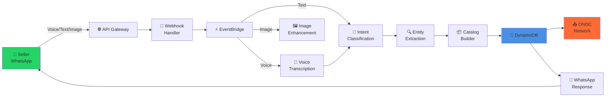
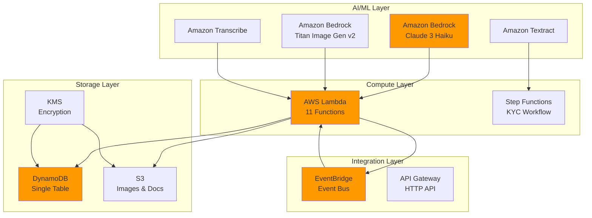
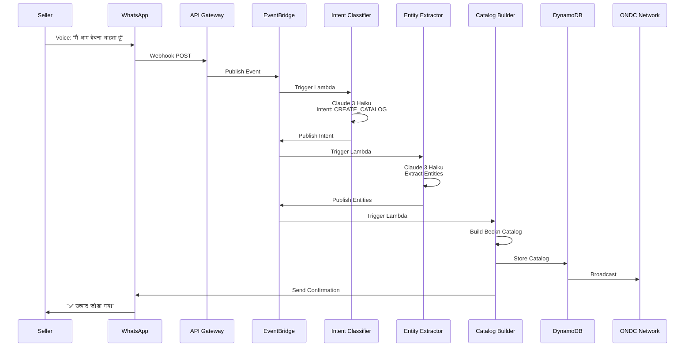

# Vyapar-Vaani

> **Voice-First ONDC Platform for Rural Indian Merchants**  
> Enabling low-literacy sellers to join India's Open Network for Digital Commerce using only WhatsApp.

<div align="center">

[](https://aws.amazon.com)
[](https://www.typescriptlang.org/)
[](https://ondc.org)
[](./test.sh)
[](./coverage)

</div>

---

## 🎯 The Problem

Rural Indian merchants face barriers to e-commerce:
- **Low digital literacy** - Can't use complex apps
- **Language barriers** - English-only interfaces
- **No technical skills** - Can't manage online catalogs
- **Limited access** - Only have basic smartphones

## 💡 Our Solution

A **zero-UI, voice-first platform** that works entirely through WhatsApp:

```
📱 WhatsApp Voice Note → 🤖 AI Processing → 🛍️ ONDC Network
```

Merchants speak in their language. We handle the rest.

---

## 🏗️ Architecture

### System Overview



### AWS Services



### Event Flow



---

## ✨ Features

<table>
<tr>
<td width="50%">

### 🎤 Voice-First
- Speak in Hindi, Marathi, or English
- No typing required
- Natural conversation flow

### 📸 Smart Images
- Upload product photos
- AI enhances to professional quality
- Titan Image Generator v2

### 🔐 Zero-UI KYC
- Upload PAN/Aadhar photos
- Automatic extraction & validation
- Instant seller registration

</td>
<td width="50%">

### 🌐 ONDC Compliant
- Full Beckn Protocol v1.2.0
- Real-time catalog sync
- Order management

### ⚡ Serverless
- Scale to zero when idle
- Pay only for usage
- Auto-scaling to millions

### 🧪 Production-Ready
- 82.62% test coverage
- 414 tests passing
- Property-based testing

</td>
</tr>
</table>

---

## 🚀 Quick Start

### Prerequisites

```bash
Node.js 20+ | AWS Account | AWS CLI | WhatsApp Business
```

### Deploy in 3 Steps

```bash
# 1. Install dependencies
npm install && npm run build

# 2. Deploy to AWS
cdk bootstrap  # First time only
cdk deploy

# 3. Test the system
./test.sh
```

**That's it!** Your voice-first ONDC platform is live.

---

## 📊 System Metrics

<table>
<tr>
<td align="center"><b>11</b><br/>Lambda Functions</td>
<td align="center"><b>7</b><br/>EventBridge Rules</td>
<td align="center"><b>5</b><br/>AI/ML Services</td>
<td align="center"><b>3</b><br/>Languages</td>
</tr>
<tr>
<td align="center"><b>82.62%</b><br/>Test Coverage</td>
<td align="center"><b>414</b><br/>Tests Passing</td>
<td align="center"><b>7-15s</b><br/>Processing Time</td>
<td align="center"><b>$15-20</b><br/>Monthly Dev Cost</td>
</tr>
</table>

---

## 🎬 How It Works

### 1️⃣ Seller Sends Voice Note

```
"मैं आम बेचना चाहता हूं, 100 रुपये प्रति किलो, 50 किलो स्टॉक है"
```

### 2️⃣ AI Processes Request

- **Intent**: CREATE_CATALOG
- **Entities**: {product: "आम", price: 100, quantity: 50, unit: "kg"}

### 3️⃣ System Creates Catalog

- Builds Beckn-compliant catalog
- Validates ONDC schema
- Stores in DynamoDB

### 4️⃣ Seller Gets Confirmation

```
✅ उत्पाद जोड़ा गया: आम, कीमत: ₹100
```

### 5️⃣ Product Goes Live on ONDC

Visible to millions of buyers across India!

---

## 🧪 Testing

### Comprehensive Test Suite

```bash
./test.sh  # 15+ end-to-end tests
```

**Tests cover:**
- ✅ All Lambda functions
- ✅ Intent classification (5 types)
- ✅ Entity extraction
- ✅ Catalog building
- ✅ DynamoDB storage
- ✅ WhatsApp integration
- ✅ Multilingual support
- ✅ Error handling

### Unit & Property Tests

```bash
npm test  # 414 tests
```

See **[TEST_GUIDE.md](TEST_GUIDE.md)** for details.

---

## 🛠️ Tech Stack

<table>
<tr>
<td><b>Language</b></td>
<td>TypeScript 5.0</td>
</tr>
<tr>
<td><b>Infrastructure</b></td>
<td>AWS CDK</td>
</tr>
<tr>
<td><b>AI/ML</b></td>
<td>Amazon Bedrock (Claude 3 Haiku, Titan Image Gen v2)</td>
</tr>
<tr>
<td><b>Compute</b></td>
<td>AWS Lambda, Step Functions</td>
</tr>
<tr>
<td><b>Storage</b></td>
<td>DynamoDB, S3, KMS</td>
</tr>
<tr>
<td><b>Integration</b></td>
<td>EventBridge, API Gateway</td>
</tr>
<tr>
<td><b>Testing</b></td>
<td>Jest, fast-check (Property-Based Testing)</td>
</tr>
</table>

---

## 📁 Project Structure

```
vyapar-vaani/
├── src/
│   ├── lambdas/          # 11 Lambda functions
│   ├── models/           # TypeScript interfaces
│   ├── services/         # Business logic
│   └── config/           # AWS clients
├── infrastructure/       # CDK stack
├── tests/
│   ├── unit/            # 405 unit tests
│   └── property/        # 9 property-based tests
├── test.sh              # E2E test suite
└── README.md
```

---

## 📚 Documentation

| Document | Description |
|----------|-------------|
| **[TEST_GUIDE.md](TEST_GUIDE.md)** | Comprehensive testing guide |
| **[COMPLETE_SYSTEM_STATUS.md](COMPLETE_SYSTEM_STATUS.md)** | System health & deployment status |
| **[.kiro/specs/vyapar-vaani/](./kiro/specs/vyapar-vaani/)** | Requirements, design, tasks |

---

## 💰 Cost Estimate

### Development (1000 messages/month)
- Claude 3 Haiku: $2-3
- Titan Image Generator: $8
- Transcribe: $1
- Textract: $1.50
- Lambda/DynamoDB/S3: $2
- **Total: ~$15-20/month**

### Production (10,000 messages/month)
- **Estimated: $150-200/month**
- Scales automatically with usage
- No upfront costs

---

## 🌟 Key Highlights

### For Rural Merchants
- 🗣️ **Speak naturally** - No typing, no forms
- 🌐 **Any language** - Hindi, Marathi, English
- 📱 **Just WhatsApp** - No app downloads
- ⚡ **Instant setup** - Start selling in minutes

### For Developers
- 🏗️ **Serverless** - Zero infrastructure management
- 🧪 **Well-tested** - 82.62% coverage, 414 tests
- 📊 **Observable** - CloudWatch logs & metrics
- 🔒 **Secure** - KMS encryption, IAM policies

### For ONDC Network
- ✅ **Beckn compliant** - Full protocol support
- 🔄 **Real-time sync** - Event-driven architecture
- 📈 **Scalable** - Handles millions of requests
- 🎯 **Reliable** - Retry logic, error handling

---

## 🤝 Contributing

We welcome contributions! Here's how:

1. Fork the repository
2. Create a feature branch
3. Write tests (maintain 80%+ coverage)
4. Submit a pull request

---

## 📄 License

MIT License - See [LICENSE](LICENSE) for details

---

## 🙏 Acknowledgments

Built for **AWS Build On India 2024**

Powered by:
- Amazon Bedrock (Claude 3 Haiku, Titan Image Generator v2)
- Amazon Transcribe, Textract
- AWS Lambda, EventBridge, DynamoDB
- Open Network for Digital Commerce (ONDC)

---

<div align="center">

**Made with ❤️ for Rural India**

[Report Bug](https://github.com/your-repo/issues) · [Request Feature](https://github.com/your-repo/issues) · [Documentation](./TEST_GUIDE.md)

</div>
