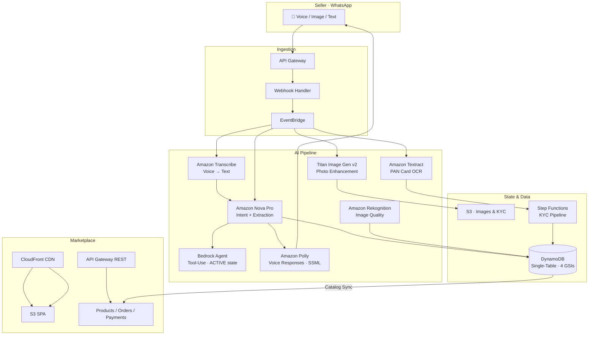
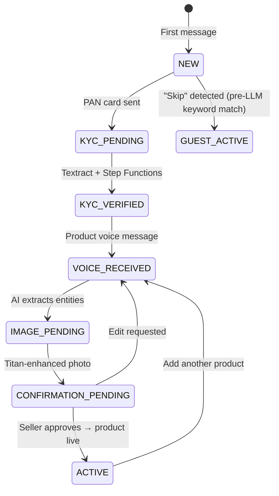

<div align="center">


# Vyapar Vaani

**Voice-First WhatsApp Commerce Platform for Rural India**

Enabling low-literacy merchants to sell online through voice messages — no typing, no apps, no training.

[](https://aws.amazon.com)
[](https://www.typescriptlang.org/)
[](https://nodejs.org/)
[](https://aws.amazon.com/bedrock/)
[](https://business.whatsapp.com/)
[](https://ondc.org/)

[**Live Marketplace**](https://d29x1w2stzqkag.cloudfront.net) · [**API**](https://o72ecc4lpg.execute-api.us-east-1.amazonaws.com/prod/) · [**Webhook**](https://m6sqkaco93.execute-api.us-east-1.amazonaws.com/whatsapp/webhook)

</div>

---

## The Problem

800M+ Indians use WhatsApp, yet rural merchants are locked out of e-commerce. Low digital literacy, regional language barriers, and feature-phone devices make conventional platforms inaccessible — they demand typing, app install, and technical training that don\'t work at the last mile.

## The Solution

Zero-UI commerce. Sellers speak in their language on WhatsApp. AI handles transcription, intent extraction, image enhancement, pricing, and order management. Buyers shop on a live web marketplace updated in real-time.

```
📱 Voice Message → 🤖 AI Agent → 🛍️ Live Marketplace → 💰 Orders → 📱 WhatsApp Alert
```

---

## Architecture



### Seller State Machine



---

## AI — What It Does and Why

This system would not exist without AI. Every seller interaction flows through a multi-stage AI pipeline:

| AI Service | Real Role | Invoked In |
|---|---|---|
| **Amazon Nova Pro** (`amazon.nova-pro-v1:0`) | Primary brain — understands Hinglish speech transcripts, extracts product entities (*"do sau tamatar ek kilo"* → ₹200/kg tomatoes), generates catalog descriptions, verifies UPI screenshots via vision API | `enhanced-agent.ts` · every user message |
| **Amazon Bedrock Agent** (`T7KG2WTAVA`) | Managed ReAct agent for ACTIVE sellers — autonomously calls 5 tools: catalog search, market price lookup, stock update, order history, analytics | `enhanced-agent.ts` · ACTIVE state only |
| **Amazon Nova Lite** (`us.amazon.nova-lite-v1:0`) | Fast fallback when Nova Pro times out (3-tier chain), plus price recommendations and product description generation | `enhanced-agent.ts` fallback; `price-recommendation.ts`; `ai-description-generator.ts` |
| **Amazon Transcribe** | Converts OGG voice messages to Hindi/Marathi/English text — the only input channel for low-literacy sellers | `voice-handler.ts` · every voice message |
| **Titan Image Gen v2** (`amazon.titan-image-generator-v2:0`) | Enhances poor-quality phone photos into professional product images with clean backgrounds | `image-enhancement.ts` · every product photo |
| **Amazon Textract** | Extracts PAN card fields (name, number, DOB) for automated KYC | `document-extraction.ts` · KYC pipeline |
| **Amazon Rekognition** | Image quality scoring and content moderation before listing | `kyc-handler.ts` · image validation |
| **Amazon Polly** (Neural) | Speaks responses in seller\'s language — Kajal (Hindi), Aditi (Marathi), Joanna (English) — SSML prosody control | `whatsapp-message-sender.ts` · every reply |

### AI Decision Flow (per message)

```
1. Voice → Transcribe (if audio)
2. Pre-LLM fast-path: regex for skip/KYC intent, price queries, language switch
3. Context: DynamoDB state + 30-day conversation memory + live market prices
4. Nova Pro (12s timeout) → retry (8s) → Nova Lite fallback (10s)
5. ACTIVE state: Bedrock Agent with tool-use runs first; direct model fallback
6. Parse MESSAGE / ACTION / DATA from model output
7. EventBridge → STORE_DATA / CREATE_CATALOG / DELETE_PRODUCT / REGISTER_UPI
8. Polly SSML → OGG audio → WhatsApp reply
```

---

## Lambda Functions (22 total)

**Core pipeline — 18 functions (`src/lambdas/`):**

| Function | Purpose |
|---|---|
| `whatsapp-webhook-handler` | Entry point — parses, validates HMAC, routes, fires EventBridge |
| `agent-handler` | State machine executor — calls enhanced-agent, runs actions |
| `voice-handler` | Downloads OGG, calls Transcribe, fires to agent-handler |
| `image-handler` | Downloads photo, fires image-enhancement, updates state |
| `image-enhancement` | Titan Image Gen v2 — background replacement + quality boost |
| `kyc-handler` | Rekognition quality check → Step Functions KYC start |
| `kyc-validation` | Validates Textract output, approves/rejects PAN |
| `document-extraction` | Textract AnalyzeDocument (FORMS + TABLES) |
| `entity-extraction` | Structured entity extraction from LLM responses |
| `intent-classification` | Route-before-LLM intent scoring |
| `seller-registration` | Creates seller DynamoDB profile after KYC |
| `confirmation-handler` | Sends confirmation card with enhanced image + extracted entities |
| `catalog-builder` | Builds Beckn-format catalog item from entities |
| `catalog-storage-broadcast` | Stores to DynamoDB, fires ONDC events |
| `marketplace-catalog-sync` | Syncs product to `marketplace-products` table |
| `agent-tools` | Bedrock Agent action group (5 tools: catalog, price, stock, orders, analytics) |
| `whatsapp-sender` | WhatsApp Cloud API — messages, typing indicators, read receipts |
| `bpp-adapter` | ONDC BPP protocol adapter (Beckn v1.2.0) |

**Marketplace API — 4 functions (`backend/lambdas/`):** `getProducts`, `submitOrder`, `verifyPayment`, `marketplace-catalog-sync`

---

## Live CloudWatch Metrics

*Real production data — 14-day window ending 4 Mar 2026, `us-east-1`, `AWS/Lambda` namespace.*

| Lambda Function | Invocations | Avg Latency | Max Latency | Errors |
|---|---|---|---|---|
| `whatsapp-webhook-handler` | **4,667** | 52 ms | 8,992 ms | 11 |
| `agent-handler` | **142** | 12,805 ms | 200,074 ms | 0 |
| `voice-handler` | **108** | 14,692 ms | 68,990 ms | 2 |
| `image-handler` | **42** | 12,946 ms | 43,183 ms | 0 |
| `kyc-handler` | **39** | 16,726 ms | 30,000 ms | 1 |
| `confirmation-handler` | **92** | 4,072 ms | 30,000 ms | 1 |

**Notes:**
- High agent-handler max (200 s) = Nova Pro + Bedrock Agent tool-use chain on complex analytics queries
- Webhook avg 52 ms — EventBridge dispatch is async; WhatsApp 15 s window never exceeded
- 22 functions, all within Lambda free tier at current test scale

### Custom Metrics — `VyaparVaani` Namespace

| Metric | Description |
|---|---|
| `TimeToNetwork` | End-to-end: webhook receipt → WhatsApp response delivery |
| `MediaDownloadDuration` | OGG/image download from WhatsApp CDN |
| `KYCProcessingDuration` | Textract + validation + registration pipeline |
| `StateTransition` | Count per NEW→KYC_PENDING→KYC_VERIFIED→ACTIVE transition |
| `Voice/TranscriptionFailure` | Failed Transcribe jobs |

### Alarms
9 CloudWatch Alarms (error rate, KYC, voice, image, DynamoDB throttle, Lambda errors/duration) + composite health alarm → SNS email alerts.

---

## Real AWS Cost — INR per Seller per Month

*Current system: ~$0/month (AWS free tier at test scale). Cost model below uses real public pricing for 1,000 MAU at 10 interactions + 2 product listings/user/month.*

### Per-Interaction Cost

| Component | Unit Price | Per Product Listing | Per Voice Query |
|---|---|---|---|
| Transcribe (30 s audio) | $0.024/min | $0.012 | $0.012 |
| Nova Pro (2K in + 500 out tokens) | $0.0008/$0.0032 per 1K | $0.0032 | $0.0032 |
| Titan Image Gen v2 | $0.012/image | $0.012 | — |
| Textract (PAN, one-time onboarding) | $0.0015/page | $0.0015 | — |
| Polly SSML (~100 chars) | $4/1M chars | $0.0004 | $0.0004 |
| Lambda + DynamoDB + S3 | Negligible at scale | ~$0.001 | ~$0.001 |
| **Per event** | | **~₹2.7** | **~₹1.3** |

### Monthly per Active Seller

| Cost Item | USD | INR (₹83/$) |
|---|---|---|
| 10 × voice transcription | $0.120 | ₹10.0 |
| 10 × Nova Pro calls | $0.060 | ₹5.0 |
| 2 × Titan image enhancements | $0.024 | ₹2.0 |
| 10 × Polly responses | $0.001 | ₹0.1 |
| Lambda + DynamoDB + S3 | ~$0.001 | ₹0.1 |
| **Total/seller/month** | **~$0.21** | **~₹17** |

### Cost at Scale

| Monthly Active Users | Monthly AWS Cost | Per Seller |
|---|---|---|
| 100 | ~$21 | ₹17 |
| 1,000 | ~$210 | ₹17 |
| 10,000 | ~$1,800 (volume pricing) | ₹15 |
| AWS Free Tier | ~500 MAU | ₹0 |

### vs. Alternatives (1,000 sellers/month)

| Approach | Monthly Cost | Availability |
|---|---|---|
| Manual data entry (3 operators) | ₹75,000 | Business hours only |
| WhatsApp Business + human agent | ₹40,000–60,000 | Limited hours |
| Custom app development + ops | ₹1,50,000+ (TCO) | 24/7 but brittle |
| **Vyapar Vaani (fully automated)** | **₹17,000** | **24/7 · 3 languages** |

**Vyapar Vaani is 4–9× cheaper than manual alternatives** with no human operators.

---

## Features

### Seller (WhatsApp)
- Voice catalog creation — Hindi/Marathi/English, zero typing required
- PAN card KYC via photo → Textract → Step Functions validation
- Titan Image Gen v2 photo enhancement (professional backgrounds)
- Real-time mandi prices from data.gov.in with Hindi commodity name mapping
- Nova Lite competitive price recommendations
- Order accept/reject via WhatsApp interactive buttons
- Sales analytics via voice — revenue, top products, trends
- UPI ID registration for direct buyer payments
- 30-day conversation memory with language/preference tracking

### Buyer (Web Marketplace)
- Products appear live within seconds of seller approval
- Search + filter by name and category
- Multi-seller cart, localStorage persistence, real-time stock sync
- UPI QR code + deep links; AI-verified payment screenshots (Nova Pro vision)
- 8-second polling for live order tracking
- AI quality badges (Top Quality / Good) from Rekognition scoring

---

## ONDC Beckn Protocol

Every seller gets a unique subscriber ID (`vyapar-vaani.ondc.in/sellers/<uuid>`) with an Ed25519 key pair for Beckn request signing. Product additions trigger `on_search` responses in Beckn v1.2.0 (`ONDC:RET10` — Food & Grocery). Orders follow the full Beckn state machine (Created → Accepted → Packed → Shipped → Delivered).

---

## AWS Services Summary

| Service | Role |
|---|---|
| Lambda (22 functions) | All compute — serverless, pay-per-invocation |
| DynamoDB (single-table) | User state, catalog, orders, conversations — 4 GSIs, TTL |
| EventBridge | Async event routing; 30-day archive for all `vyapar.vaani.*` events |
| Step Functions | KYC pipeline (Textract → validate → seller-registration) |
| S3 (3 buckets) | Enhanced images, KYC docs, marketplace SPA frontend |
| CloudFront | CDN for buyer marketplace |
| API Gateway v2 (HTTP) | WhatsApp webhook (low-latency Lambda proxy) |
| API Gateway v1 (REST) | Marketplace API — CORS, API key auth, ONDC endpoint |
| KMS | Encryption at rest for all DynamoDB + S3 data |
| CloudWatch | 9 alarms + composite health + custom `VyaparVaani` namespace |
| SNS | Email alerts on alarm state changes |

---

## Code Quality

| Check | Status |
|---|---|
| TypeScript strict mode | ✅ 0 errors |
| ESLint (typescript-eslint) | ✅ 0 errors |
| Unit tests | 27 |
| Integration tests | 5 |
| Property-based tests (fast-check) | 27 |
| Total | 59 tests |

```bash
npm run lint           # ESLint
npx tsc --noEmit       # Type check
npm test               # All 59 tests
npm run test:coverage  # Coverage report
```

---

## Project Structure

```
src/
├── lambdas/       # 18 Lambda handlers
├── services/      # AI agent, state machine, analytics, conversation memory
├── models/        # TypeScript interfaces (catalog, order, KYC, Beckn, voice)
├── tools/         # Web search, mandi price lookup (data.gov.in)
├── config/        # AWS SDK clients, CloudWatch metrics, EventBridge patterns
└── utils/         # Hindi numeral normalization, helpers
infrastructure/    # CDK stacks + CloudWatch alarms + SNS
backend/lambdas/   # Marketplace API (getProducts, submitOrder, verifyPayment)
marketplace/       # Buyer SPA (HTML/JS/CSS · CloudFront → S3)
tests/             # unit/ · integration/ · property/
docs/              # Cost estimates, environment variables, troubleshooting
```

---

## Quick Start

```bash
npm install
npx tsc && cp -r backend/* dist/backend/ && npx cdk deploy --all --require-approval never
```

**Prerequisites:** AWS CLI configured, Node.js 20.x, AWS CDK, WhatsApp Business API credentials, Amazon Bedrock model access (Nova Pro `amazon.nova-pro-v1:0`, Titan Image Gen v2).

---

## Live Endpoints

| | URL |
|---|---|
| Marketplace | [d29x1w2stzqkag.cloudfront.net](https://d29x1w2stzqkag.cloudfront.net) |
| Marketplace API | [o72ecc4lpg.execute-api.us-east-1.amazonaws.com/prod/](https://o72ecc4lpg.execute-api.us-east-1.amazonaws.com/prod/) |
| WhatsApp Webhook | [m6sqkaco93.execute-api.us-east-1.amazonaws.com/whatsapp/webhook](https://m6sqkaco93.execute-api.us-east-1.amazonaws.com/whatsapp/webhook) |
| ONDC BPP API | [m6sqkaco93.execute-api.us-east-1.amazonaws.com/beckn/{action}](https://m6sqkaco93.execute-api.us-east-1.amazonaws.com/beckn/) |
| Bedrock Agent | `T7KG2WTAVA` · us-east-1 |
| DynamoDB Table | `vyapar-vaani-data` |

---

<div align="center">

**Built for Bharat** 🇮🇳

*Empowering rural commerce through voice AI*

</div>
