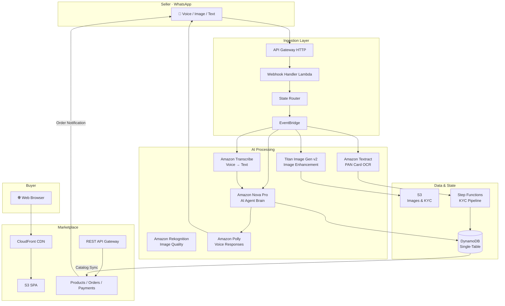
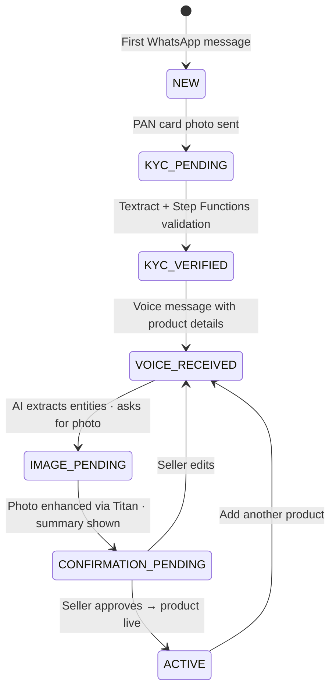
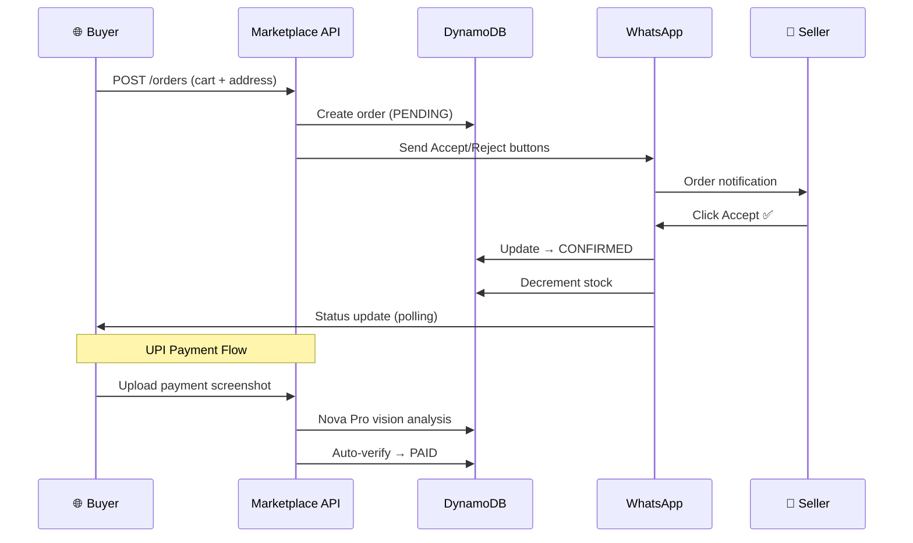

<div align="center">


# Vyapar Vaani

**Voice-First WhatsApp Commerce Platform for Rural India**

Enabling low-literacy merchants to sell online through voice messages — no typing, no apps, no training.

[](https://aws.amazon.com)
[](https://www.typescriptlang.org/)
[](https://nodejs.org/)
[](https://aws.amazon.com/bedrock/)
[](https://business.whatsapp.com/)

[**Live Marketplace**](https://d29x1w2stzqkag.cloudfront.net) · [**API**](https://o72ecc4lpg.execute-api.us-east-1.amazonaws.com/prod/) · [**Webhook**](https://m6sqkaco93.execute-api.us-east-1.amazonaws.com/whatsapp/webhook) · [**Docs**](docs/)

</div>

---

## The Problem

**800M+ Indians** use WhatsApp, yet rural merchants remain locked out of e-commerce. Low digital literacy, Hindi/regional language barriers, and feature-phone-level smartphones make conventional platforms inaccessible. Traditional solutions demand typing, app installation, and technical training — none of which work at the last mile.

## The Solution

Vyapar Vaani is a **zero-UI commerce platform**. Sellers speak in their native language on WhatsApp. AI handles everything else — transcription, product listing, image enhancement, pricing, and order management. Buyers shop through a real-time web marketplace.

```
📱 Voice Message → 🤖 AI Agent → 🛍️ Live Marketplace → 💰 Orders → 📱 WhatsApp Alert
```

---

## Architecture



### Seller Onboarding & Catalog Flow



### Order Flow



---

## Key Features

### Seller Experience (WhatsApp)

| Feature | Implementation |
|---|---|
| **Voice Catalog Creation** | Speak product name, price, quantity in Hindi/Marathi/English → AI extracts structured data |
| **PAN Card KYC** | Photo → Textract OCR → Step Functions validation → auto-registration |
| **Image Enhancement** | Product photos auto-enhanced with professional backgrounds (Titan Image Gen v2) |
| **Live Mandi Prices** | Real-time market prices from [data.gov.in](https://data.gov.in) API with Hindi commodity mapping |
| **Smart Pricing** | AI-powered competitive price recommendations based on marketplace data |
| **Order Management** | Accept/reject orders via WhatsApp buttons, real-time stock sync |
| **Sales Analytics** | Revenue breakdowns, top products, daily/weekly/monthly trends — all via voice |
| **UPI Registration** | Sellers register UPI ID to receive direct payments from buyers |
| **Multilingual Voice** | Amazon Polly responses in Hindi (Kajal), Marathi (Aditi), English (Joanna) |
| **Conversation Memory** | 30-day context with preference tracking for natural interactions |

### Buyer Experience (Web)

| Feature | Implementation |
|---|---|
| **Real-Time Marketplace** | Products appear within seconds of seller approval |
| **Search & Filter** | By product name and category |
| **Shopping Cart** | Multi-seller support, localStorage persistence, quantity controls |
| **UPI Payments** | QR code generation, deep links to UPI apps, AI-powered screenshot verification |
| **Cash on Delivery** | Available as payment option |
| **Live Order Tracking** | 8-second polling for real-time status updates |
| **Quality Badges** | AI-scored "Top Quality" / "Good" labels on products |

---

## Why AI?

The core challenge is **bridging the digital divide** — turning unstructured voice in regional languages into structured e-commerce data, with zero manual intervention.

| AI Service | Why It's Essential |
|---|---|
| **Amazon Nova Pro** (Bedrock) | Conversational AI agent — understands Hindi/Hinglish intent, extracts product entities from natural speech (e.g., *"do sau pachaas rupaye kilo tamatar"* → ₹250/kg tomatoes), generates descriptions, verifies UPI screenshots via vision |
| **Amazon Transcribe** | Converts Hindi/Marathi voice messages to text — the only input method for low-literacy sellers |
| **Titan Image Gen v2** (Bedrock) | Enhances poor-quality phone photos into professional product images — critical for marketplace trust |
| **Amazon Textract** | Extracts PAN card details for automated KYC — no manual data entry |
| **Amazon Rekognition** | Image quality analysis + content moderation before marketplace listing |
| **Amazon Polly** (Neural) | Speaks responses back in seller's language — completing the voice-first loop |
| **Amazon Nova Lite** (Bedrock) | Lightweight image quality feedback and price recommendation reasoning |

---

## Metrics & Cost

| Metric | Value |
|---|---|
| Monthly cost (1,000 users) | **~$200** |
| Cost per user per month | **$0.199** |
| Onboarding cost (one-time) | **$0.016** |
| Cost per product listing | **~$0.057** |
| Free tier coverage | **~500 users/month** |
| Top cost driver | Titan Image Enhancement (60%) |
| Voice-first vs text-only | 19× cost, but **3× higher completion rate** |
| Optimization potential | **56–63% reduction** achievable |

---

## Tech Stack

| Layer | Technology |
|---|---|
| **Compute** | AWS Lambda (Node.js 20.x) — 17+ functions |
| **AI/ML** | Amazon Bedrock (Nova Pro, Nova Lite, Titan Image), Transcribe, Polly, Textract, Rekognition |
| **Data** | DynamoDB (single-table design, 4 GSIs, TTL), S3 |
| **Orchestration** | EventBridge (event-driven routing, 30-day archive), Step Functions (KYC pipeline) |
| **API** | API Gateway v2 (HTTP — webhook), API Gateway v1 (REST — marketplace) |
| **Frontend** | Vanilla JS SPA, CloudFront CDN, S3 hosting |
| **Security** | KMS encryption at rest, WhatsApp signature validation |
| **Monitoring** | CloudWatch (9 alarms + composite health), SNS email alerts, custom metrics namespace |
| **IaC** | AWS CDK (TypeScript) |

---

## API

**Base URL**: [`https://o72ecc4lpg.execute-api.us-east-1.amazonaws.com/prod/`](https://o72ecc4lpg.execute-api.us-east-1.amazonaws.com/prod/)

| Method | Endpoint | Description |
|---|---|---|
| `GET` | `/products` | List all active marketplace products with presigned image URLs |
| `POST` | `/orders` | Submit order (multi-seller cart split, WhatsApp notification to sellers) |
| `GET` | `/orders/{orderId}` | Get order status |
| `POST` | `/orders/{orderId}/verify-payment` | Verify UPI payment (AI screenshot analysis or manual reference) |

---

## Monitoring

- **9 CloudWatch Alarms** — error rate, state transitions, media downloads, KYC, transcription, image enhancement, DynamoDB throttling, Lambda errors, Lambda duration
- **Composite Health Alarm** — triggers on any critical alarm
- **Custom Metrics** — `TimeToNetwork`, `CatalogRejectionRate`, `ImageEnhancementSuccessRate`, `OrderAcceptanceRate`
- **Event Archive** — 30-day EventBridge retention for all `vyapar.vaani.*` events
- **SNS Notifications** — email alerts on alarm state changes

---

## Project Structure

```
vyapar-vaani/
├── src/
│   ├── lambdas/           # 16 Lambda handlers (webhook, agent, KYC, catalog, voice, image)
│   ├── services/          # 17 service modules (AI agent, state router, analytics, memory)
│   ├── models/            # TypeScript types & interfaces
│   ├── config/            # AWS SDK client configuration
│   ├── tools/             # Web search, mandi price lookup
│   └── utils/             # Hindi number normalization, helpers
├── infrastructure/
│   ├── stacks/            # CDK stacks (main + marketplace integration)
│   └── monitoring/        # CloudWatch alarms, dashboards, SNS
├── marketplace/           # Buyer SPA (HTML/JS/CSS)
├── backend/lambdas/       # Marketplace API handlers (products, orders, payments)
├── tests/
│   ├── unit/              # 27 unit tests
│   ├── integration/       # 5 integration tests
│   └── property/          # 27 property-based tests (fast-check)
└── docs/                  # Cost estimates, environment variables, troubleshooting
```

---

## Quick Start

```bash
# Install
npm install

# Configure environment
cp .env.example .env
# Set: WHATSAPP_ACCESS_TOKEN, WHATSAPP_PHONE_NUMBER_ID, AWS_REGION

# Deploy
npx tsc && cp -r backend/* dist/backend/ && npx cdk deploy --all

# Run tests
npm test
```

### Prerequisites

- AWS Account with CLI configured
- Node.js 20.x, AWS CDK
- WhatsApp Business API credentials
- Amazon Bedrock model access (Nova Pro, Titan Image Gen v2)

---

## Live URLs

| Resource | URL |
|---|---|
| **Marketplace** | [d29x1w2stzqkag.cloudfront.net](https://d29x1w2stzqkag.cloudfront.net) |
| **API** | [o72ecc4lpg.execute-api.us-east-1.amazonaws.com/prod/](https://o72ecc4lpg.execute-api.us-east-1.amazonaws.com/prod/) |
| **Webhook** | [m6sqkaco93.execute-api.us-east-1.amazonaws.com/whatsapp/webhook](https://m6sqkaco93.execute-api.us-east-1.amazonaws.com/whatsapp/webhook) |

---

## Testing

```bash
npm test                  # Unit tests (27)
npm run test:coverage     # Coverage report
npm run test:integration  # Integration tests (5)
npm run test:property     # Property-based tests (27)
```

---

<div align="center">

**Built for Bharat** 🇮🇳

*Empowering rural commerce through voice AI*

</div>
