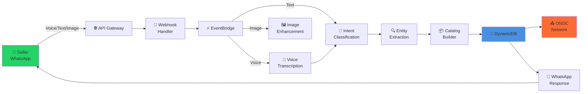
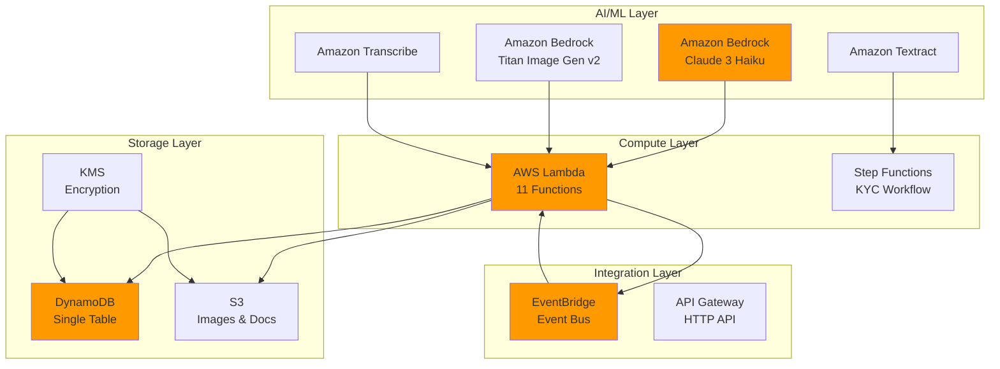
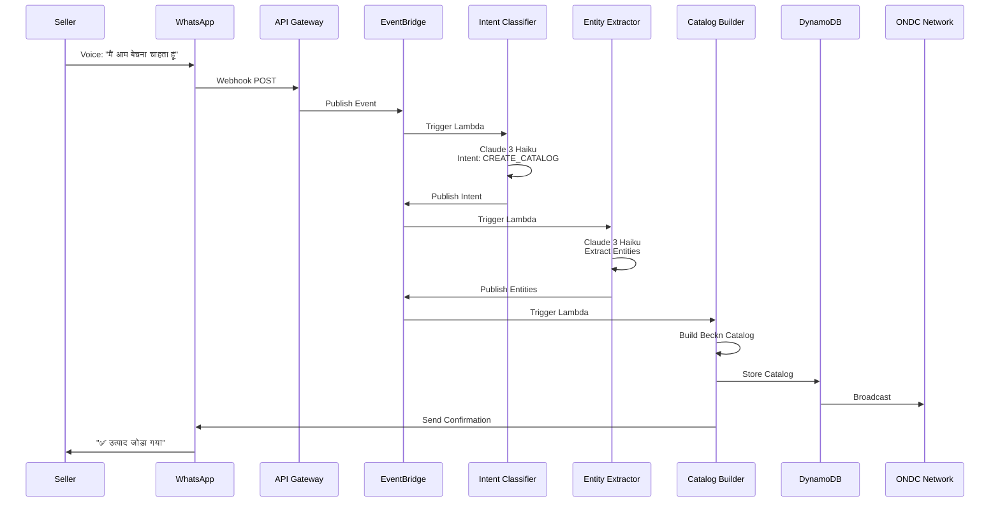

# Vyapar-Vaani

> **Voice-First ONDC Platform for Rural Indian Merchants**  
> Enabling low-literacy sellers to join India's Open Network for Digital Commerce using only WhatsApp.

<div align="center">

[](https://aws.amazon.com)
[](https://www.typescriptlang.org/)
[](https://ondc.org)
[](./test.sh)
[](./coverage)

</div>

---

## 🎯 The Problem

Rural Indian merchants face barriers to e-commerce:
- **Low digital literacy** - Can't use complex apps
- **Language barriers** - English-only interfaces
- **No technical skills** - Can't manage online catalogs
- **Limited access** - Only have basic smartphones

## 💡 Our Solution

A **zero-UI, voice-first platform** that works entirely through WhatsApp:

```
📱 WhatsApp Voice Note → 🤖 AI Processing → 🛍️ ONDC Network
```

Merchants speak in their language. We handle the rest.

---

## 🏗️ Architecture

### System Overview



### AWS Services



### Event Flow



---

## ✨ Features

<table>
<tr>
<td width="50%">

### 🎤 Voice-First
- Speak in Hindi, Marathi, or English
- No typing required
- Natural conversation flow

### 📸 Smart Images
- Upload product photos
- AI enhances to professional quality
- Titan Image Generator v2

### 🔐 Zero-UI KYC
- Upload PAN/Aadhar photos
- Automatic extraction & validation
- Instant seller registration

</td>
<td width="50%">

### 🌐 ONDC Compliant
- Full Beckn Protocol v1.2.0
- Real-time catalog sync
- Order management

### ⚡ Serverless
- Scale to zero when idle
- Pay only for usage
- Auto-scaling to millions

### 🧪 Production-Ready
- 82.62% test coverage
- 414 tests passing
- Property-based testing

</td>
</tr>
</table>

---
