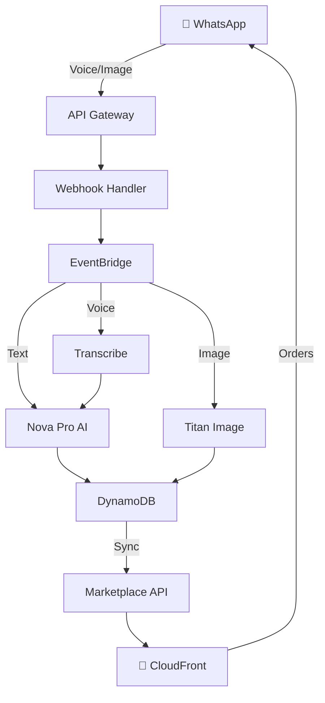

# Vyapar Vaani

> **Voice-First Commerce Platform for Rural India**  
> WhatsApp-based marketplace enabling low-literacy sellers through voice AI.

<div align="center">

[](https://aws.amazon.com)
[](https://www.typescriptlang.org/)
[](https://nodejs.org/)

[Live Marketplace](https://d29x1w2stzqkag.cloudfront.net) • [Quick Start](#quick-start) • [API](#api)

</div>

---

## Problem

Rural Indian merchants cannot access e-commerce due to low digital literacy, language barriers, and lack of technical skills. Only have WhatsApp on basic smartphones.

## Solution

**Zero-UI platform**: Sellers speak in Hindi/Marathi → AI processes → Product live in marketplace → Buyers order → Seller notified.

```
📱 Voice → 🤖 AI → 🛍️ Marketplace → 💰 Orders
```

---

## Architecture



### Stack

| Component | Technology |
|-----------|-----------|
| Frontend | HTML/JS, CloudFront |
| API | API Gateway, Lambda |
| AI | AWS Transcribe, Bedrock (Nova Pro, Titan) |
| Storage | DynamoDB, S3 |
| Messaging | EventBridge, WhatsApp API |

---

## Features

### Sellers (Voice-First)

✅ **Voice Onboarding** - PAN card photo + voice guidance  
✅ **Voice Catalog** - Speak product details (name, price, quantity)  
✅ **Multilingual** - Hindi, Marathi, English auto-detection  
✅ **AI Extraction** - Structured data from natural speech  
✅ **Image Enhancement** - Auto-enhance photos with Titan  
✅ **Voice Confirmation** - Interactive buttons + voice playback  
✅ **Order Alerts** - WhatsApp notifications

### Buyers (Web)

✅ **Real-Time Sync** - Products appear in 5 seconds  
✅ **Search & Filter** - By name and category  
✅ **Shopping Cart** - Multi-product checkout  
✅ **Order Submission** - With delivery address

---

## Quick Start

### Prerequisites

- AWS Account with CLI configured
- Node.js 20.x
- WhatsApp Business API credentials
- AWS CDK installed

### Setup

```bash
# Clone and install
git clone <repo-url>
cd vyapar-vaani
npm install

# Configure
cp .env.example .env
# Edit .env with WhatsApp credentials

# Deploy
npm run deploy

# Clear database (optional)
node clear-database.js
```

### Environment

```bash
WHATSAPP_API_ENDPOINT=https://graph.facebook.com/v18.0
WHATSAPP_ACCESS_TOKEN=your_token
WHATSAPP_PHONE_NUMBER_ID=your_id
AWS_REGION=us-east-1
```

---

## Usage

### Seller Flow

```
1. Send message → Bot: "कृपया अपने पैन कार्ड की फोटो भेजें।" (voice)
2. Send PAN photo → Bot: "धन्यवाद! आपका पंजीकरण सफल रहा।" (voice)
3. Voice: "मैं आम बेचना चाहता हूँ, 50 किलो, 100 रुपये"
4. Bot: "बहुत अच्छा! अब फोटो भेजें।" (voice)
5. Send photo → Bot shows confirmation with buttons
6. Click ✅ Approve → Product live in marketplace
```

### Buyer Flow

1. Visit https://d29x1w2stzqkag.cloudfront.net
2. Browse products
3. Add to cart → Checkout
4. Seller gets WhatsApp notification

---

## API

**Base**: `https://o72ecc4lpg.execute-api.us-east-1.amazonaws.com/prod/`

### GET /products

```json
{
  "success": true,
  "products": [{
    "productId": "uuid",
    "name": "आम",
    "price": 100,
    "quantity": 50,
    "unit": "kg",
    "seller": {"name": "राज कुमार", "phone": "91..."},
    "imageUrl": "https://..."
  }]
}
```

### POST /orders

```json
{
  "buyer": {
    "name": "Amit",
    "phone": "91...",
    "address": {"street": "...", "city": "Mumbai", ...}
  },
  "items": [{"productId": "uuid", "quantity": 2}],
  "totalAmount": 200
}
```

---

## Testing

```bash
npm test              # Unit tests
npm run test:coverage # Coverage report
```

---

## Project Structure

```
vyapar-vaani/
├── src/
│   ├── lambdas/          # Lambda handlers
│   ├── services/         # Business logic
│   ├── models/           # TypeScript types
│   └── config/           # AWS clients
├── infrastructure/       # CDK stacks
├── marketplace/          # Buyer web UI
├── backend/             # Marketplace backend
└── tests/               # Test suites
```

---

## Deployed URLs

- **Marketplace**: https://d29x1w2stzqkag.cloudfront.net
- **API**: https://o72ecc4lpg.execute-api.us-east-1.amazonaws.com/prod/
- **Webhook**: https://m6sqkaco93.execute-api.us-east-1.amazonaws.com/whatsapp/webhook

---

## AI Models Used

- **Voice Transcription**: AWS Transcribe (Hindi, Marathi, English)
- **Intent Classification**: Amazon Nova Pro (Bedrock)
- **Entity Extraction**: Amazon Nova Pro (Bedrock)
- **Image Enhancement**: Amazon Titan Image Generator v2 (Bedrock)
- **Voice Synthesis**: Amazon Polly (Kajal, Aditi, Joanna)

---

## License

MIT

---

<div align="center">

**Built for Rural India** 🇮🇳

</div>
