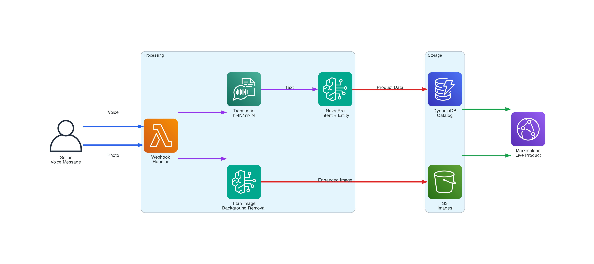
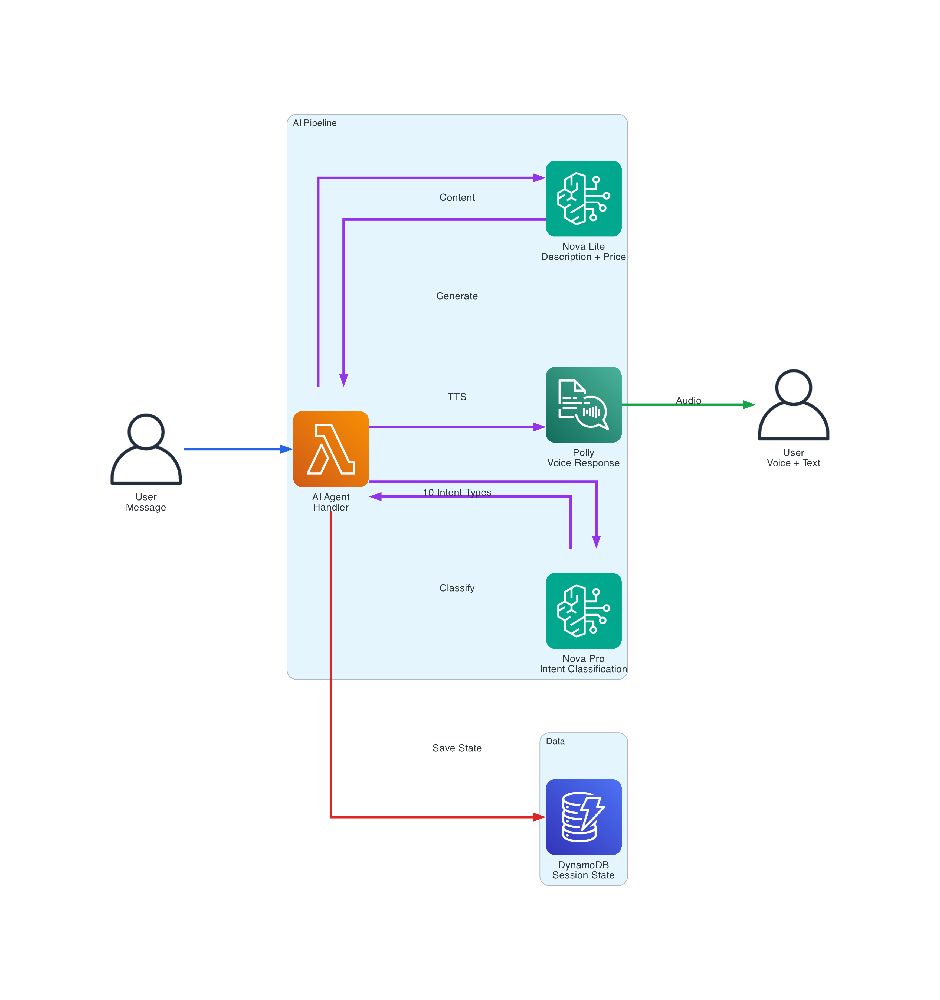
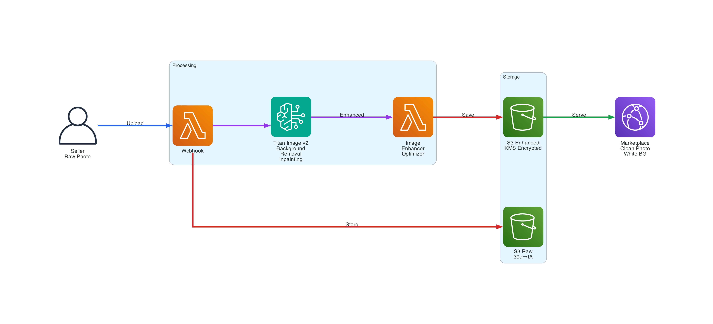
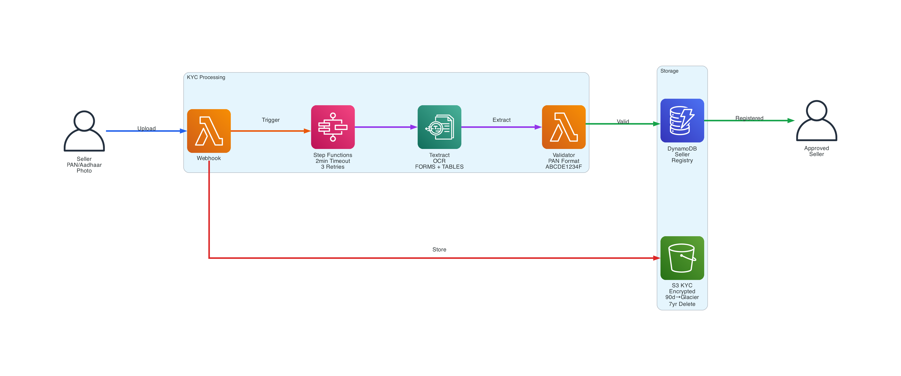
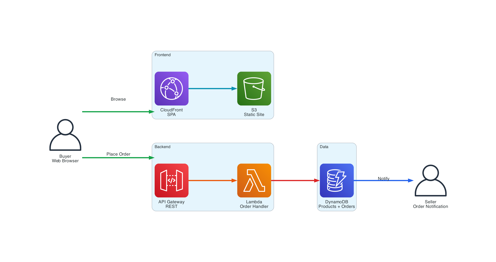
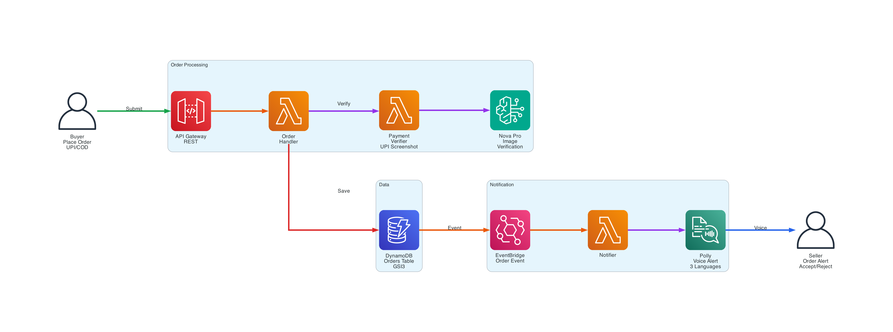
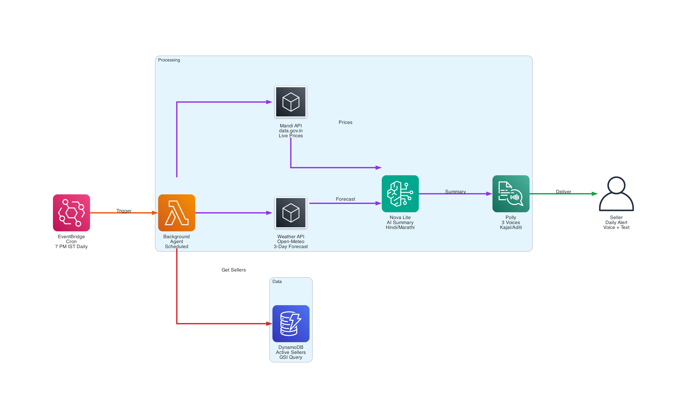

<div align="center">


# Vyapar Vaani   

### ( Seller:&nbsp;  &nbsp;+91-8902418321 &nbsp;&nbsp;&nbsp;&nbsp;&nbsp; | &nbsp;&nbsp;&nbsp;&nbsp;&nbsp; Buyer Marketplace Website:&nbsp; [**Live Marketplace →**](https://d29x1w2stzqkag.cloudfront.net) )

~~~
🟡 Sellers Send WhatsApp Voice Message 🗣️ hi!  |  Defaults to Hindi — want English? Just say →  "Talk in English!"
~~~
---
**500M Indian Rural Sellers can't navigate through complex apps.**

*Vyapar Vaani is Zero UI — no forms, no apps, no menus. Just WhatsApp — the app 800M Indians already know. Speak in any Indian language (Now supports Hindi, English & Marathi), and let AI handle product listings, pricing, product photography, and orders.*

</br>

[](https://aws.amazon.com)
[](https://aws.amazon.com/bedrock/)
[](https://www.typescriptlang.org/)
[](tests/)
[](https://ondc.org/)
[](https://business.whatsapp.com/)


</div>

---

## Problem

Rural merchants aren't offline because they lack smartphones or internet — they're offline because **every e-commerce platform demands digital literacy they don't have**: app installs, form filling, menu navigation, and onboarding flows designed for urban, educated users.

This friction exists in Hindi just as much as English. Translating an interface doesn't eliminate it. **The interaction model itself is broken for 500M+ Indians at the last mile.**

## Solution

Vyapar Vaani removes the interface entirely. A seller speaks a voice message on WhatsApp — the one app they already know. AI handles everything else: transcription, product extraction, photo enhancement, market pricing, and live listing. **No forms. No menus. No steps to learn. Zero digital literacy required.**

---

## Why AI Is Non-Negotiable

> Remove AI and this product cannot function. A non-AI version would require sellers to type product names, prices, and descriptions in English — the exact barrier being solved.

| Barrier | Without AI | With AI (AWS Service) |
|---|---|---|
| **Language** — seller speaks Hindi/Marathi | Must type in English | **Transcribe** auto-detects language, converts speech to text |
| **Literacy** — cannot type product details | Cannot list products | **Nova Pro** extracts name, price, quantity, unit from natural speech |
| **Photography** — cluttered backgrounds | Unprofessional images | **Titan Image v2** removes background, creates clean product photos |
| **Pricing** — no market awareness | Over/underprices | **Nova Lite** + live mandi data recommends optimal price |
| **Orders** — cannot read notifications | Misses orders | **Polly** reads order details aloud in seller's language |
| **KYC** — cannot fill forms | Blocked from selling | **Textract** extracts PAN/Aadhaar fields from a photo |
| **Payments** — screenshot verification | Manual, error-prone | **Nova Pro** verifies UPI payment screenshots |
| **Business insight** — no analytics | Operates blind | **Nova Lite** generates PDF reports with AI recommendations |

In a typical session (listing one product), AI is invoked **7 times**: Transcribe → Nova Pro (intent) → Nova Pro (entities) → Nova Lite (description) → Titan (image) → Nova Lite (price) → Polly (voice confirmation).

---

## Architecture

<div align="center">

</div>

**4-Layer Event-Driven Design** (Left → Right):

- **External**: WhatsApp Cloud API · API Gateway (HTTP + REST) · Sellers + Buyers
- **Event & Compute**: EventBridge (17 rules) · Lambda (23 functions) · Step Functions (KYC)
- **AI/ML**: Bedrock (Nova Pro/Lite + Titan) · Transcribe · Textract · Polly
- **Data & Security**: DynamoDB (2 tables, 7 GSIs) · S3 (3 buckets) · CloudFront · KMS · IAM (23 roles)

**Color-Coded Flows**: Blue (Seller) · Purple (AI) · Red (Storage) · Orange (KYC) · Green (Marketplace) · Teal (CDN) · Gray (Security)

---

## Key Workflows

### 1. Seller Voice to Product Listing

Seller speaks in Hindi/Marathi → AI extracts product details → Photo enhancement → Live on marketplace

<div align="center">

</div>

### 2. AI Agent Processing

Every message goes through intent classification → entity extraction → response generation → voice output

<div align="center">

</div>

### 3. Image Enhancement Pipeline

Raw product photo → Titan removes background → White background → Enhanced image stored → Served via CDN

<div align="center">

</div>

### 4. KYC Verification

Seller uploads PAN/Aadhaar → Textract extracts fields → Validation → Registered seller

<div align="center">

</div>

### 5. Buyer Marketplace Journey

Buyer browses products → Places order → Payment verification → Seller notified via WhatsApp

<div align="center">

</div>

### 6. Order Management

Order placed → Payment verified → Saved to DynamoDB → EventBridge triggers notification → Polly reads order to seller

<div align="center">

</div>

### 7. Daily Background Agent

Every day at 7 PM IST → Fetch weather + mandi prices → AI generates Hindi summary → Voice message to all sellers

<div align="center">

</div>

---

## AWS Services

| # | Service | Role | Scale |
|---|---|---|---|
| 1 | **Lambda** | All compute — webhook, AI agents, voice, image, KYC, orders | 23 functions |
| 2 | **Bedrock** | LLM (Nova Pro + Lite) + Titan image generation | 4 model IDs |
| 3 | **DynamoDB** | Sellers, products, orders, sessions, state | 2 tables, 7 GSIs |
| 4 | **S3** | Product images, voice files, PDF reports, KYC docs, SPA | 3 buckets |
| 5 | **Transcribe** | Voice → text with auto language detection | Per-message jobs |
| 6 | **Polly** | Text → speech in 3 voices (Kajal · Aditi · Joanna) | Neural engine |
| 7 | **Textract** | KYC document OCR — PAN / Aadhaar extraction | AnalyzeDocument |
| 8 | **EventBridge** | Event-driven routing — 17 rules, 30-day archive | 1 bus |
| 9 | **Step Functions** | KYC pipeline — extract → validate → register | 1 state machine |
| 10 | **API Gateway** | WhatsApp webhook (HTTP) + Marketplace buyer API (REST) | 2 APIs, 7 endpoints |
| 11 | **CloudFront** | Marketplace SPA CDN with S3 OAI | 1 distribution |
| 12 | **KMS** | Encryption at rest — DynamoDB + S3, auto-rotation | 1 customer key |
| 13 | **SQS** | Dead-letter queue for EventBridge failures | 14-day retention |

---

## AI Models

| Model | ID | Used For |
|---|---|---|
| **Nova Pro** | `amazon.nova-pro-v1:0` | Intent classification (10 types), entity extraction, UPI payment screenshot verification |
| **Nova Lite** | `us.amazon.nova-lite-v1:0` | Product descriptions, price recommendations, daily alert generation |
| **Nova Lite** | `amazon.nova-lite-v1:0` | PDF report AI recommendations + voice summary |
| **Titan Image v2** | `amazon.titan-image-generator-v2:0` | Product photo background removal + white background inpainting |

---

## Language Support

| Language | Transcribe | Polly Voice | LLM Prompts |
|---|---|---|---|
| **Hindi** (hi-IN) | Auto-detect | Kajal Neural | ✅ |
| **Marathi** (mr-IN) | Auto-detect | Aditi Neural | ✅ |
| **English** (en-IN) | Auto-detect | Joanna Neural | ✅ |

- Auto language detection via `IdentifyLanguage` — no manual selection needed
- Runtime language switching mid-conversation ("English mein baat karo")
- 35+ commodity names mapped across Devanagari, Romanised Hindi, and English for mandi price lookups

---

## ONDC Integration

Full Beckn protocol implementation: `search` → `select` → `init` → `confirm` → `status` → `update` → `cancel` → `track`

All endpoints are ONDC-compliant with `@ondc/org` extensions for catalog, orders, and fulfillment.

---

## Security

| Layer | Implementation |
|---|---|
| Encryption at rest | KMS customer-managed key — DynamoDB + S3 |
| Encryption in transit | TLS — API Gateway, CloudFront, WhatsApp API |
| KYC documents | Separate encrypted bucket · Glacier after 90 days · Delete after 7 years |
| API authentication | WhatsApp webhook signature verification + Marketplace API key |
| IAM | Per-Lambda scoped policies (23 role policies, least privilege) |
| Reliability | SQS DLQ (14-day) + 30-day EventBridge archive |

---

## Codebase

| Component | Files | LOC |
|---|---|---|
| `src/` — Lambdas, services, models, utils | 49 TypeScript files | 18,543 |
| `infrastructure/` — CDK stacks | 2 files | 1,640 |
| `tests/` — Unit + integration | 69 test files | 909 cases |
| `marketplace/` — Buyer SPA | 4 files (HTML/JS/CSS) | — |
| `backend/` — Marketplace API handlers | 4 JS files | — |

```
src/
├── lambdas/    17 Lambda handlers
├── services/   17 modules (AI agent, analytics, TTS, reports…)
├── models/      8 data models (order, intent, seller, catalog…)
├── config/      3 files (AWS clients, constants, env)
├── tools/       1 module (web search, market prices)
└── utils/       3 utilities (formatting, validation, Hindi number normalisation)
```

---

## Deployment

```bash
npm install
npm run build
cp -r node_modules/pdfmake dist/src/node_modules/pdfmake
npx cdk deploy --all
```

**Stack:** Node.js 20.x · TypeScript 5.x · CDK v2 · Region: `us-east-1`

---

<div align="center">

**Built for the [AWS Hackathon for Bharat](https://awshackathonforbharat.devpost.com/)**

*Vyapar Vaani — giving every rural seller a voice in digital commerce.*

</div>
