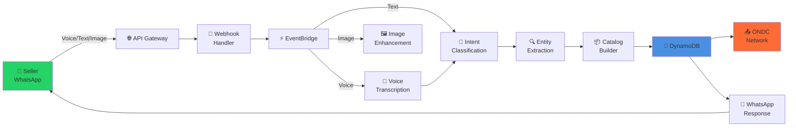
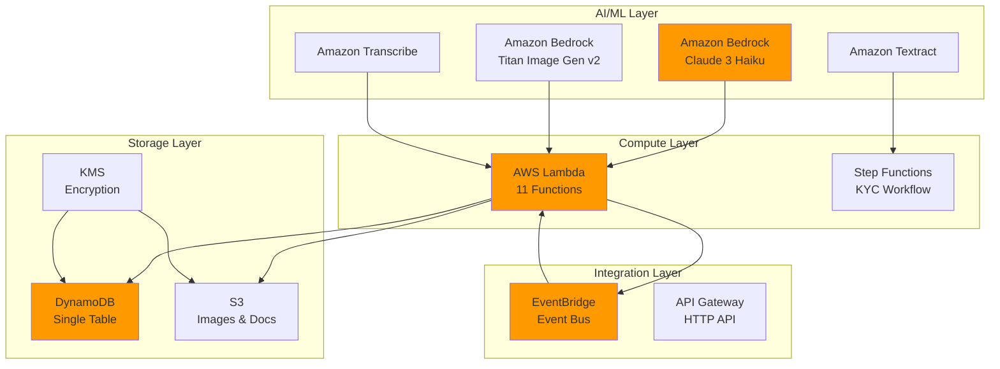
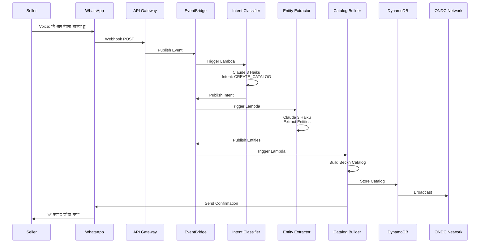
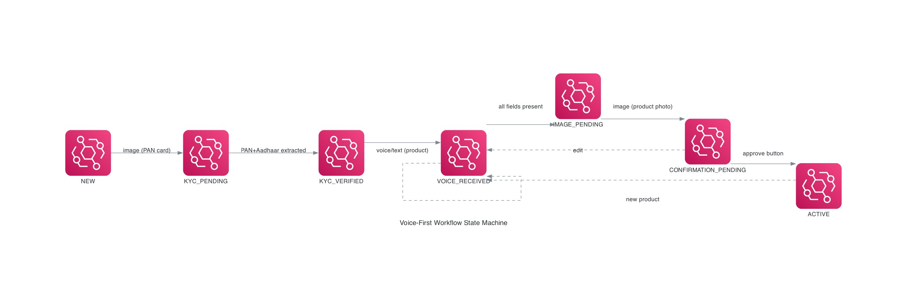
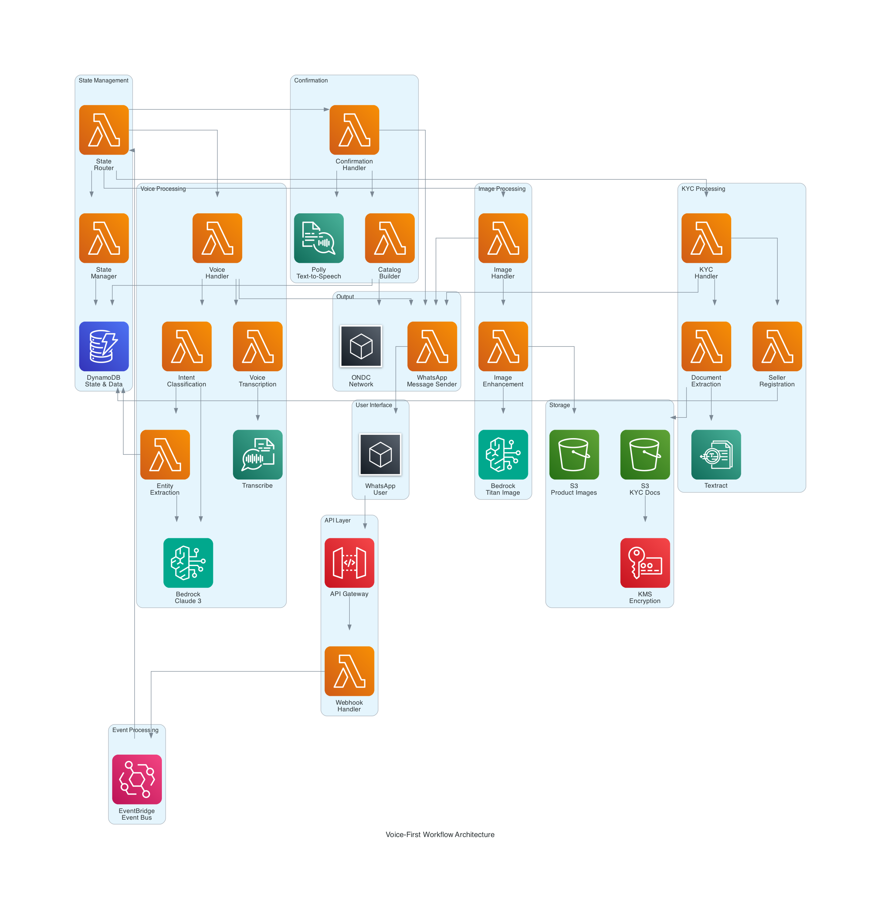

# Vyapar-Vaani

> **Voice-First ONDC Platform for Rural Indian Merchants**  
> Enabling low-literacy sellers to join India's Open Network for Digital Commerce using only WhatsApp.

<div align="center">

[](https://aws.amazon.com)
[](https://www.typescriptlang.org/)
[](https://ondc.org)
[](./test.sh)
[](./coverage)

</div>

---

## 🎯 The Problem

Rural Indian merchants face barriers to e-commerce:
- **Low digital literacy** - Can't use complex apps
- **Language barriers** - English-only interfaces
- **No technical skills** - Can't manage online catalogs
- **Limited access** - Only have basic smartphones

## 💡 Our Solution

A **zero-UI, voice-first platform** that works entirely through WhatsApp:

```
📱 WhatsApp Voice Note → 🤖 AI Processing → 🛍️ ONDC Network
```

Merchants speak in their language. We handle the rest.

---

## 🏗️ Architecture

### System Overview



### AWS Services



### Event Flow



---

## 🎙️ Voice-First Workflow

The voice-first workflow enables complete merchant onboarding and catalog creation using only voice messages and photos through WhatsApp. Designed for low-literacy rural merchants who prefer speaking over typing.

### Complete Onboarding Journey

```
1. KYC Verification → 2. Voice Product Description → 3. Image Enhancement → 4. Confirmation → 5. ONDC Broadcast
```

#### 1️⃣ KYC Verification
- Merchant sends PAN card photo via WhatsApp
- Amazon Textract extracts PAN and Aadhaar numbers
- Automatic seller registration with encrypted KYC data
- State transitions from `NEW` → `KYC_VERIFIED`

#### 2️⃣ Voice Product Description
- Merchant speaks product details in Hindi, Marathi, or English
- Amazon Transcribe converts speech to text with language detection
- Amazon Bedrock (Claude 3 Haiku) extracts product entities
- System prompts for missing information using Amazon Polly
- State: `KYC_VERIFIED` → `VOICE_RECEIVED` → `IMAGE_PENDING`

#### 3️⃣ Image Enhancement
- Merchant sends product photo
- Amazon Titan Image Generator v2 enhances to professional quality
- Both original and enhanced images stored in S3
- State: `IMAGE_PENDING` → `CONFIRMATION_PENDING`

#### 4️⃣ Confirmation & Approval
- System generates text and voice summary in merchant's language
- Interactive buttons: "Approve" or "Edit"
- On approval, creates ONDC-compliant catalog
- State: `CONFIRMATION_PENDING` → `ACTIVE`

#### 5️⃣ ONDC Broadcast
- Catalog automatically broadcast to ONDC network
- Merchant receives success confirmation
- Ready to receive orders

### State Machine

The workflow is driven by a finite state machine that tracks each user's progress:



**States:**
- `NEW` - New user, awaiting KYC
- `KYC_PENDING` - KYC document submitted, processing
- `KYC_VERIFIED` - KYC complete, ready for product info
- `VOICE_RECEIVED` - Product info received, may need more details
- `IMAGE_PENDING` - Awaiting product photo
- `CONFIRMATION_PENDING` - Awaiting merchant approval
- `ACTIVE` - Onboarded, can add more products

### Architecture Diagram



The architecture uses event-driven processing with EventBridge routing messages to appropriate handlers based on user state and message type.

---

## ✨ Features

<table>
<tr>
<td width="50%">

### 🎤 Voice-First
- Speak in Hindi, Marathi, or English
- No typing required
- Natural conversation flow

### 📸 Smart Images
- Upload product photos
- AI enhances to professional quality
- Titan Image Generator v2

### 🔐 Zero-UI KYC
- Upload PAN/Aadhar photos
- Automatic extraction & validation
- Instant seller registration

</td>
<td width="50%">

### 🌐 ONDC Compliant
- Full Beckn Protocol v1.2.0
- Real-time catalog sync
- Order management

### ⚡ Serverless
- Scale to zero when idle
- Pay only for usage
- Auto-scaling to millions

### 🧪 Production-Ready
- 82.62% test coverage
- 414 tests passing
- Property-based testing

</td>
</tr>
</table>

---

## 🔧 Configuration

### Environment Variables

The voice-first workflow requires several environment variables for configuration. See [docs/ENVIRONMENT_VARIABLES.md](docs/ENVIRONMENT_VARIABLES.md) for complete documentation.

#### Required Variables

```bash
# WhatsApp Integration
WHATSAPP_ACCESS_TOKEN=your_access_token
WHATSAPP_PHONE_NUMBER_ID=your_phone_number_id
WHATSAPP_VERIFY_TOKEN=vyapar-vaani-webhook-token

# ONDC Configuration
ONDC_REGISTRY_URL=https://registry.ondc.org/api/v1
NETWORK_PARTICIPANT_ID=vyapar-vaani.ondc.in
BPP_BASE_URL=https://api.vyapar-vaani.ondc.in
```

#### Optional Variables (with defaults)

```bash
# Text-to-Speech Voices
POLLY_VOICE_ID_HINDI=Kajal          # Neural voice for Hindi
POLLY_VOICE_ID_MARATHI=Aditi        # Neural voice for Marathi
POLLY_VOICE_ID_ENGLISH=Joanna       # Neural voice for English

# Media File Limits
MAX_AUDIO_SIZE_MB=16                # WhatsApp audio limit
MAX_IMAGE_SIZE_MB=5                 # Recommended for Lambda

# State Management
STATE_TTL_DAYS=7                    # Auto-cleanup incomplete flows

# Feature Flags (for phased rollout)
VOICE_FIRST_ENABLED=true
KYC_FLOW_ENABLED=true
IMAGE_ENHANCEMENT_ENABLED=true
```

#### AWS Resources (Auto-configured by CDK)

These are automatically set during deployment:
- `TABLE_NAME` - DynamoDB table
- `KYC_BUCKET_NAME` - S3 bucket for KYC documents
- `PRODUCTS_BUCKET_NAME` - S3 bucket for product images
- `EVENT_BUS_NAME` - EventBridge event bus
- `KMS_KEY_ID` - KMS encryption key
- `KYC_STATE_MACHINE_ARN` - Step Functions state machine

### Setup Instructions

1. **Clone and Install**
   ```bash
   git clone <repository-url>
   cd vyapar-vaani
   npm install
   ```

2. **Configure Environment**
   ```bash
   cp .env.example .env
   # Edit .env with your WhatsApp and ONDC credentials
   ```

3. **Deploy to AWS**
   ```bash
   npm run build
   cdk bootstrap  # First time only
   cdk deploy
   ```

4. **Configure WhatsApp Webhook**
   - Get the API Gateway URL from CDK output
   - Set webhook URL in WhatsApp Business API dashboard
   - Use `WHATSAPP_VERIFY_TOKEN` for verification

---

## 🐛 Troubleshooting Guide

### Common Issues

#### 1. Voice Transcription Fails

**Symptoms:** Audio messages not being processed, no response from system

**Possible Causes:**
- Audio file too large (>16MB)
- Unsupported audio format
- Amazon Transcribe service limits reached

**Solutions:**
```bash
# Check Lambda logs
aws logs tail /aws/lambda/voice-transcription --follow

# Verify audio file size in WhatsApp webhook payload
# Supported formats: audio/ogg, audio/mpeg, audio/amr

# Check Transcribe quotas
aws service-quotas get-service-quota \
  --service-code transcribe \
  --quota-code L-D8EC5E8A
```

**User Guidance:** System automatically sends error message in user's language requesting shorter audio or different format.

#### 2. KYC Document Extraction Fails

**Symptoms:** PAN card photo not recognized, extraction errors

**Possible Causes:**
- Poor image quality (blurry, dark, angled)
- Invalid document format
- Amazon Textract confidence too low

**Solutions:**
```bash
# Check document extraction logs
aws logs tail /aws/lambda/document-extraction --follow

# Review Textract confidence scores in logs
# Minimum confidence threshold: 80%

# Test with sample PAN card
npm test -- --testPathPattern="document-extraction"
```

**User Guidance:** System sends message requesting clearer photo in good lighting.

#### 3. State Management Issues

**Symptoms:** User stuck in wrong state, workflow not progressing

**Possible Causes:**
- DynamoDB write failures
- Race condition from concurrent messages
- State transition validation failed

**Solutions:**
```bash
# Check user state in DynamoDB
aws dynamodb get-item \
  --table-name vyapar-vaani-data \
  --key '{"PK":{"S":"USER#<phone>"},"SK":{"S":"STATE"}}'

# Reset user state (use carefully)
aws dynamodb update-item \
  --table-name vyapar-vaani-data \
  --key '{"PK":{"S":"USER#<phone>"},"SK":{"S":"STATE"}}' \
  --update-expression "SET #state = :state" \
  --expression-attribute-names '{"#state":"state"}' \
  --expression-attribute-values '{":state":{"S":"NEW"}}'

# Check state transition logs
aws logs tail /aws/lambda/state-manager --follow
```

**User Guidance:** System sends message asking user to type "start" to begin again.

#### 4. Image Enhancement Slow/Fails

**Symptoms:** Long wait times, enhancement errors

**Possible Causes:**
- Amazon Titan service throttling
- Image too large or invalid format
- Lambda timeout (3 min limit)

**Solutions:**
```bash
# Check image enhancement logs
aws logs tail /aws/lambda/image-enhancement --follow

# Verify Bedrock Titan quotas
aws service-quotas get-service-quota \
  --service-code bedrock \
  --quota-code L-3E8C9F6B

# Disable enhancement temporarily (uses original image)
aws lambda update-function-configuration \
  --function-name image-enhancement \
  --environment "Variables={IMAGE_ENHANCEMENT_ENABLED=false}"
```

**Fallback:** System automatically uses original image if enhancement fails.

#### 5. WhatsApp Messages Not Sending

**Symptoms:** No responses to user, confirmations not delivered

**Possible Causes:**
- Invalid WhatsApp access token
- Phone number not registered
- Rate limiting

**Solutions:**
```bash
# Verify WhatsApp token
curl -X GET "https://graph.facebook.com/v22.0/me?access_token=$WHATSAPP_ACCESS_TOKEN"

# Check message sender logs
aws logs tail /aws/lambda/whatsapp-message-sender --follow

# Test message sending
npm test -- --testPathPattern="whatsapp-message-sender"

# Verify phone number status
curl -X GET "https://graph.facebook.com/v22.0/$WHATSAPP_PHONE_NUMBER_ID?access_token=$WHATSAPP_ACCESS_TOKEN"
```

**Rate Limits:** WhatsApp allows 1000 messages per second per phone number.

#### 6. Language Detection Issues

**Symptoms:** Wrong language responses, prompts in incorrect language

**Possible Causes:**
- Transcribe language detection confidence low
- Mixed language input
- Language preference not stored

**Solutions:**
```bash
# Check language detection in transcription logs
aws logs filter-pattern "detectedLanguage" /aws/lambda/voice-transcription

# Verify user language preference in DynamoDB
aws dynamodb get-item \
  --table-name vyapar-vaani-data \
  --key '{"PK":{"S":"USER#<phone>"},"SK":{"S":"STATE"}}' \
  --projection-expression "language"

# Test language detection
npm test -- --testPathPattern="voice-transcription.test"
```

**Default Behavior:** System defaults to Hindi if language detection fails.

### Monitoring and Alerts

#### CloudWatch Dashboards

View real-time metrics:
```bash
# Open CloudWatch dashboard
aws cloudwatch get-dashboard --dashboard-name VyaparVaaniMetrics
```

**Key Metrics:**
- State transition counts by type
- Processing duration by handler
- Error rates by category
- Media download success/failure rates

#### CloudWatch Alarms

Configured alarms:
- High error rate (>5% in 5 minutes)
- DynamoDB throttling
- Lambda timeout rate (>10%)
- KYC processing failures

#### X-Ray Tracing

Enable detailed tracing:
```bash
# View service map
aws xray get-service-graph --start-time <timestamp> --end-time <timestamp>

# Trace specific request
aws xray get-trace-summaries --start-time <timestamp> --end-time <timestamp>
```

### Debug Mode

Enable verbose logging:
```bash
# Set LOG_LEVEL for specific Lambda
aws lambda update-function-configuration \
  --function-name voice-handler \
  --environment "Variables={LOG_LEVEL=DEBUG}"
```

### Getting Help

- **Documentation:** [docs/](docs/)
- **Issues:** GitHub Issues
- **Logs:** CloudWatch Logs Insights
- **Support:** AWS Support (for service-specific issues)

---

## 💰 Cost Estimates

### Per 1,000 Users/Month

Based on typical usage patterns (1 KYC + 3 products per user):

| Service | Usage | Unit Cost | Monthly Cost |
|---------|-------|-----------|--------------|
| **AI/ML Services** | | | |
| Amazon Transcribe | 3,000 voice messages × 30s | $0.024/min | $36.00 |
| Amazon Polly (Neural) | 6,000 prompts × 50 chars | $0.016/1M chars | $4.80 |
| Amazon Textract | 1,000 documents | $0.015/page | $15.00 |
| Amazon Bedrock (Claude 3 Haiku) | 6,000 requests × 1K tokens | $0.00025/1K tokens | $1.50 |
| Amazon Bedrock (Titan Image) | 3,000 images | $0.04/image | $120.00 |
| **Compute** | | | |
| AWS Lambda | 30,000 invocations × 512MB × 3s | $0.0000166667/GB-sec | $7.50 |
| **Storage** | | | |
| Amazon S3 | 15GB storage + 10,000 requests | $0.023/GB + $0.0004/1K | $0.75 |
| Amazon DynamoDB | 100,000 writes + 50,000 reads | On-demand pricing | $13.75 |
| **Integration** | | | |
| Amazon EventBridge | 30,000 events | $1.00/million | $0.03 |
| API Gateway | 30,000 requests | $1.00/million | $0.03 |
| **Security** | | | |
| AWS KMS | 10,000 requests | $0.03/10K | $0.03 |
| **Data Transfer** | | | |
| Data Transfer Out | 5GB to internet | $0.09/GB | $0.45 |
| | | **Total** | **~$199.84** |

### Cost Per User

- **Onboarding (KYC + 3 products):** ~$0.20/user
- **Additional product:** ~$0.05/product
- **Monthly active user (10 products):** ~$0.50/user

### Cost Optimization Tips

#### 1. Use Provisioned Concurrency Selectively
```bash
# Only for webhook handler (high traffic)
aws lambda put-provisioned-concurrency-config \
  --function-name webhook-handler \
  --provisioned-concurrent-executions 5
```
**Savings:** Reduces cold start latency without significant cost increase.

#### 2. Enable S3 Lifecycle Policies
```bash
# Archive old media after 30 days
aws s3api put-bucket-lifecycle-configuration \
  --bucket vyapar-vaani-products \
  --lifecycle-configuration file://lifecycle.json
```
**Savings:** ~60% on storage costs for old images.

#### 3. Use DynamoDB On-Demand Pricing
- Automatically scales with traffic
- No capacity planning needed
- Pay only for actual reads/writes

**Savings:** ~30% compared to provisioned capacity for variable workloads.

#### 4. Batch EventBridge Events
```typescript
// Batch multiple events in single publish
await eventBridge.putEvents({
  Entries: events.map(event => ({...}))
});
```
**Savings:** Reduces EventBridge costs by ~50%.

#### 5. Cache Polly Audio Responses
```typescript
// Cache common prompts in S3
const cachedAudio = await s3.getObject({
  Bucket: 'audio-cache',
  Key: `${language}/${promptKey}.mp3`
});
```
**Savings:** ~80% on Polly costs for repeated prompts.

#### 6. Optimize Lambda Memory
```bash
# Use AWS Lambda Power Tuning
npm install -g aws-lambda-power-tuning
lambda-power-tuning --function voice-handler
```
**Savings:** 20-40% on Lambda costs by right-sizing memory.

#### 7. Use Reserved Capacity (High Volume)

For >10,000 users/month:
- DynamoDB Reserved Capacity: 50% savings
- Savings Plans for Lambda: 17% savings
- Bedrock Provisioned Throughput: 30% savings

### Cost Monitoring

#### Set Up Billing Alerts
```bash
aws cloudwatch put-metric-alarm \
  --alarm-name VyaparVaaniCostAlert \
  --alarm-description "Alert when daily cost exceeds $50" \
  --metric-name EstimatedCharges \
  --namespace AWS/Billing \
  --statistic Maximum \
  --period 86400 \
  --evaluation-periods 1 \
  --threshold 50 \
  --comparison-operator GreaterThanThreshold
```

#### Track Costs by Service
```bash
# View cost breakdown
aws ce get-cost-and-usage \
  --time-period Start=2024-01-01,End=2024-01-31 \
  --granularity MONTHLY \
  --metrics BlendedCost \
  --group-by Type=SERVICE
```

#### Cost Allocation Tags
```typescript
// Tag all resources in CDK
Tags.of(stack).add('Project', 'VyaparVaani');
Tags.of(stack).add('Environment', 'Production');
Tags.of(stack).add('CostCenter', 'ONDC');
```

### Free Tier Benefits

AWS Free Tier includes (first 12 months):
- Lambda: 1M requests/month + 400,000 GB-seconds
- DynamoDB: 25GB storage + 25 WCU + 25 RCU
- S3: 5GB storage + 20,000 GET + 2,000 PUT
- API Gateway: 1M requests/month
- CloudWatch: 10 custom metrics + 5GB logs

**Estimated free tier coverage:** ~500 users/month

---

## 📊 Testing

### Test Coverage

```bash
npm test
```

**Results:**
- **414 tests passing**
- **82.62% coverage**
- Unit tests + Property-based tests

### Test Categories

#### Unit Tests
- Specific examples and edge cases
- Integration with AWS services (mocked)
- Error handling scenarios

#### Property-Based Tests
- Universal properties across all inputs
- State machine consistency
- Data integrity guarantees

### Run Specific Tests

```bash
# Voice workflow tests
npm test -- --testPathPattern="voice"

# KYC tests
npm test -- --testPathPattern="kyc"

# State management tests
npm test -- --testPathPattern="state"

# Property-based tests only
npm test -- --testPathPattern="property"
```

---

## 📚 Documentation

- **[Environment Variables](docs/ENVIRONMENT_VARIABLES.md)** - Complete configuration guide
- **[Troubleshooting Guide](docs/TROUBLESHOOTING.md)** - Common issues and solutions
- **[Cost Estimates](docs/COST_ESTIMATES.md)** - Detailed cost breakdown and optimization
- **[Requirements](.kiro/specs/voice-first-workflow/requirements.md)** - Detailed requirements
- **[Design](.kiro/specs/voice-first-workflow/design.md)** - Architecture and design decisions
- **[Tasks](.kiro/specs/voice-first-workflow/tasks.md)** - Implementation tasks

---

## 🚀 Deployment

### Prerequisites

- AWS Account with appropriate permissions
- Node.js 18+ and npm
- AWS CDK CLI: `npm install -g aws-cdk`
- WhatsApp Business API access
- ONDC network participant credentials

### Deployment Steps

1. **Configure AWS Credentials**
   ```bash
   aws configure
   ```

2. **Install Dependencies**
   ```bash
   npm install
   ```

3. **Build Project**
   ```bash
   npm run build
   ```

4. **Bootstrap CDK (first time only)**
   ```bash
   cdk bootstrap
   ```

5. **Deploy Stack**
   ```bash
   cdk deploy
   ```

6. **Configure WhatsApp Webhook**
   - Copy API Gateway URL from CDK output
   - Set in WhatsApp Business API dashboard
   - Verify with `WHATSAPP_VERIFY_TOKEN`

### Phased Rollout

Use feature flags for gradual rollout:

```bash
# Phase 1: Deploy infrastructure (no user impact)
cdk deploy -c VOICE_FIRST_ENABLED=false

# Phase 2: Enable KYC for new users
aws lambda update-function-configuration \
  --function-name webhook-handler \
  --environment "Variables={KYC_FLOW_ENABLED=true}"

# Phase 3: Enable voice transcription
aws lambda update-function-configuration \
  --function-name webhook-handler \
  --environment "Variables={VOICE_FIRST_ENABLED=true}"

# Phase 4: Enable image enhancement
aws lambda update-function-configuration \
  --function-name image-handler \
  --environment "Variables={IMAGE_ENHANCEMENT_ENABLED=true}"
```

---

## 🤝 Contributing

Contributions are welcome! Please follow these guidelines:

1. Fork the repository
2. Create a feature branch
3. Write tests for new functionality
4. Ensure all tests pass: `npm test`
5. Submit a pull request

---

## 📄 License

[Add your license here]

---

## 🙏 Acknowledgments

- **ONDC** - Open Network for Digital Commerce
- **AWS** - Cloud infrastructure and AI/ML services
- **WhatsApp Business API** - Messaging platform
- Rural merchants of India - Our inspiration

---

**Built with ❤️ for rural Indian merchants**
